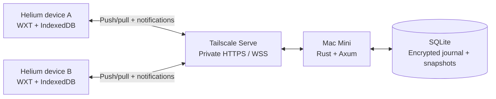

# Helium Sync — Implementation Plan

**Status:** Core capture, encrypted transport, key lifecycle, history ciphertext purge/expiry, local storage limits and requested UI are implemented. Session expiry, retained-copy policy, scale/recovery checks and joint Helium acceptance remain before section 10.

**Updated:** 2026-10-02

**Checklist audit:** Reconciled implementation and native evidence through `47567e4`, then recorded routed setup/spacing at `1cee5fb` the native UI/startup follow-up at `ae87613`, and selected history removal at `a97063c`. The saved-collection action follow-up is committed at `5df642d`; native root-move interaction is recorded at `027f7d7` and remains unverified below. The native 24-tab restore and focused session-detail route checkpoint are committed at `f688edd` below.

## Current goal status

Continue disposable-profile testing and simplify the extension setup/navigation. The routed UI and spacing revision are implemented, preview-verified and loaded in both named Helium test profiles. Native navigation, saved identity/settings, two-way diagnostic messages and the approved single-visit removal pass. A fresh options tab recovered rendering without quitting Helium; the removed visit stays absent after manual sync/reload in both profiles, while native history and the neighboring fixture remain. Saved collections now offer Open even when capture is off; Test 2’s 98 saved snapshots remain browsable with capture paused. A native 24-tab window restore now passes exact order/count, active selection and automatic completion. Saved-session details have their own route, verified in Test 2 with reload and filtered Back. Fresh file-based native onboarding and user feedback remain open. The native first pass has also verified pairing, bookmark creation/reverse rename, current/closed sessions, pinned/grouped window restoration, original-time history, a short outage and worker stop/revival. Every whole milestone exit gate remains open.

| Checkpoint                                                         | Status                                                              | Commit / evidence                                                                      |
| ------------------------------------------------------------------ | ------------------------------------------------------------------- | -------------------------------------------------------------------------------------- |
| Bookmarks, sessions, history capture/transport                     | Implemented and automated checks pass                               | `a0429bd` and earlier checkpoints; native gates open                                   |
| Relay quotas, resource bounds, durable cursor ACKs                 | Complete implementation checkpoint                                  | `890bad2`; 142 TS, 18 Rust, 8 real-process tests at that checkpoint                    |
| Single-use private pairing and durable enrollment                  | Complete implementation checkpoint                                  | `4d34eed`; 151 TS, 23 Rust, 9 real-process tests at that checkpoint                    |
| Future-data key rotation / fresh-profile recovery                  | Complete implementation checkpoint; native gate open                | `3d1e9f3`; 176 TS, 31 Rust, 11 real-process tests                                      |
| Logo and favicon                                                   | Complete branding implementation checkpoint                         | `9b2e6da`; PNG/ICO assets, typechecks/build and synthetic UI pass                      |
| Dark square UI, Tailwind/shadcn and TypeScript aliases             | Complete implementation checkpoint; native gate open                | `93bea2c`; 176 TS, 11 real-process tests, production build/UI                          |
| History plaintext/ciphertext erasure                               | Client/relay purge implemented; retained-copy/backup gates open     | `3a6bedd`; 215 TS, 40 Rust, 12 real-process tests                                      |
| Local budgets, retention, full-scale journal performance, recovery | Storage/history expiry implemented; session/scale/recovery pending  | `a28c1b1`, `abc7bea`; 236 TS, 14 real-process tests                                    |
| Consistent relay snapshots and restore guards                      | Implemented; missing acknowledged-operation replay remains open     | `09bf1bd`; 44 Rust, 16 real-process tests; [recovery contract](relay-recovery.md)      |
| Native Helium APIs, worker lifecycle and hours-long outage         | Pairing/domains/removal/short outage/worker pass; restart gate open | `b753fce`, `483b08b`, `1d00114`, `448dd49`, `47567e4`; [native smoke](native-smoke.md) |
| Guided setup, separate routes and consistent shadcn spacing        | Preview and native navigation/message pass; fresh onboarding open   | `1cee5fb`; 237 TS tests, production build and route/layout checks                      |
| Production hosting / Tailscale / launchd / backup deployment       | Deferred until implementation and joint testing                     | Section 10 onward                                                                      |

Latest recorded checks: **237 TS tests, 44 Rust tests, 16 real-process integrations**, typechecks, production WXT build, rustfmt/clippy, formatting, version consistency and Changeset status. Worker checkpoint: `47567e4`; closure fix: `1d00114`; backup/restore guards: `09bf1bd`. No release/version bump or production deployment has been performed. This UI checkpoint reruns TypeScript checks, 237 TS tests and the production WXT build. All 16 real-process integrations also passed during this work; the 44 Rust test result is from the preceding server checkpoint. Synthetic previews establish layout/setup behavior. Both native profiles now use the revised UI assets with the same approved background bytes, permissions, extension origin and relay.

### Remaining before full acceptance

[remaining-work.md](remaining-work.md) consolidates all current pending work with suggested owners; historical checkpoint notes below record the scope at their dates.

- [x] Load the revised packaged UI in Helium Sync Test 1 and Test 2; verify navigation, direct reload/back, legacy hash migration and two-way diagnostics while preserving installation identities and collection settings.
- [ ] Verify fresh file-based native enrollment/pairing/recovery and obtain user feedback on clarity.
- [x] Verify the approved single native test-visit removal after manual sync and reload in both profiles; preserve the neighboring fixture and native browser history.
- [ ] Verify native URL/source/global clears and delayed reconnect/reconciliation.
- [ ] Verify full browser restart, alarm behavior and an hours-long offline run with concurrent domain edits.
- [x] Open saved sessions on a focused route with visible restoration controls/progress; verify native reload/Back and preserve paused capture.
- [x] Restore one native 24-tab fixture window across the bounded restoration passes; verify exact order/count, active tab and the complete journal.
- [x] Verify one empty native folder cut/paste across roots and two-step Undo propagated to the peer after reload.
- [x] Restore one reviewed native three-window snapshot: verify 5/5 supported pages, 3/3 completed windows, internal-page skips and preserved source fixtures.
- [ ] Complete the native bookmark drag/child/conflict/root/interruption matrix and interrupted large/multi-window restores; measure representative latency.
- [ ] Implement session expiry/count/size policy and finish unresolved/shared capture, general quarantine and historical backup-copy policy.
- [ ] Measure and complete full-scale history/journal/restore responsiveness.
- [ ] Recover missing acknowledged operations after older-backup/server loss and verify safe reconciliation/resume.
- [ ] Complete native key rotation/fresh-author recovery and minimum-version/release compatibility checks.

Both checklist copies are updated at checkpoints and commits. [progress.md](progress.md) identifies the evidence for each implementation step; [native-smoke.md](native-smoke.md) records observed browser results. Section 10 production deployment stays deferred until implementation and joint acceptance pass.

**Testing readiness:** The basic native smoke pass is underway in Helium Sync Test 1 and Test 2, on Helium 0.18.1.1 / Chromium 154.0.0.0. The approved single history removal passes after manual sync/reload in both profiles, with native history and the neighboring fixture preserved. Fresh tab navigation recovered rendering without a whole-app restart; the earlier blank-page cause remains unconfirmed. Full browser restart, hours-long outage, remaining native permutations, session/retained-copy policy, scale and complete recovery are still open. Section 10 is Mac Mini deployment, availability and backups, after joint acceptance.

**Stack:** WXT + TypeScript extension; Rust + Axum + SQLite server; Mac Mini hosting; Tailscale networking.  
**Phase-one scope:** Bookmarks, history, current sessions, closed/previous sessions, encryption, offline operation, and self-hosting.  
**Future research:** Optional iCloud backup or alternate sync transport. No iCloud implementation in phase one.

## How to track progress

- `[x]` marks implemented work with the recorded automated evidence, or a specifically observed native check. `[ ]` marks unfinished or unverified work. Native, endurance, scale and production exit gates stay separate; an implementation checkbox does not complete those gates.
- Split mixed tasks into completed and remaining parts so completed work is visible without hiding its outstanding acceptance criteria.
- Mark a milestone complete only when its exit gate passes; scaffolding alone does not count.
- Record significant decisions and deviations in the decision log at the end.
- Record evidence beside completed gates: test results, relevant commits, or manual verification notes.
- If an item is blocked, add a short `Blocked: ...` note below it and continue independent work.

| Milestone                                        | Status                                                 | Depends on | Evidence and remaining exit work                                                                                |
| ------------------------------------------------ | ------------------------------------------------------ | ---------- | --------------------------------------------------------------------------------------------------------------- |
| M1 — Compatibility and hosting probes            | Native basic APIs/worker pass; gate open               | None       | `b753fce`, `1d00114`, `47567e4`; remaining API/alarm/browser-version matrix and Tailscale/reboot probes         |
| M2 — Durable local state and encrypted transport | Implementation and short native pass; gate open        | M1         | 237 TS / 44 Rust / 16 integrations; full browser restart and hours-long outage pending                          |
| M3 — Bidirectional bookmarks                     | Implementation/basic native pass; gate open            | M2         | Model/adapter conflict tests; native creation/reverse rename/outage/revival pass; full native matrix pending    |
| M4 — Current, closed, and previous sessions      | Implementation/basic native pass; gate open            | M2         | Current/closed, grouped/pinned, 24-tab and three-window restore pass; interruption/lifecycle acceptance pending |
| M5 — Cross-device history and deletion           | Implementation/native capture/search pass; gate open   | M2         | Purge/expiry automated checks; native removal/clears, retained-copy policy and scale pending                    |
| M6 — Production hosting and recovery             | Backup/restore guards implemented; deployment deferred | M3–M5      | `09bf1bd`; full replay/resume, launchd/Tailscale/availability/scheduled backup gates pending                    |
| M7 — Product polish and release                  | Requested branding/UI/aliases implemented; gate open   | M6         | `9b2e6da`, `93bea2c`; remaining retention/compatibility/distribution/daily-use acceptance pending               |

## Initial implementation checkpoint — 2026-10-01

These checks apply to synthetic diagnostic notes only. They do not complete browser adapters or milestone exit gates. See [progress.md](progress.md) for evidence and current limitations.

- [x] Move the repository to `/Users/mihirpandey/Work/fun/helium-synk`, outside Documents/iCloud.
- [x] Initialize WXT/React, TypeScript core, and Rust/SQLite workspaces with lockfiles.
- [x] Configure Conventional Commit validation and private-package Changesets.
- [x] Persist local diagnostic records and the encrypted outgoing queue atomically.
- [x] Reserve unique author counters durably and preserve immutable ciphertext across retries.
- [x] Use client-side HKDF and AES-256-GCM with fresh nonces/authenticated metadata.
- [x] Issue distinct profile API credentials; store only their hashes on the relay.
- [x] Commit encrypted relay records with WAL/FULL durability before acknowledging/broadcasting.
- [x] Validate idempotent retries, conflicting identities, byte-bounded batches, and ordered cursor pages.
- [x] Verify SQLite storage exhaustion rejects without acknowledging, preserves client queues, and permits an identical retry after recovery.
- [x] Commit decrypted incoming records and cursor progress together; retain the cursor on failure.
- [x] Pause safely on a changed server epoch while retaining local work.
- [x] Add authenticated WebSocket hints and an alarm/reconnect reconciliation path.
- [x] Build an enrollment/status/recovery-key/test-note options dashboard.
- [x] Verify short synthetic outages, client database reopening, and relay restart across the real HTTP boundary.
- [x] Load the production extension build and verify the basic domain smoke flows in two disposable Helium profiles with DevTools closed; see the native first-pass checklist.
- [ ] Complete the remaining native API/conflict/removal/restart/scale acceptance permutations.
- [x] Verify native worker termination/revival with DevTools closed (`47567e4`).
- [ ] Verify an hours-long browser outage and full browser restart.
- [ ] Configure and verify private HTTPS/WSS through Tailscale Serve on the Mac Mini.
- [ ] Complete the remaining M1/M2 exit gates before daily use of bookmark sync.

## Native bookmark implementation checkpoint — 2026-10-01

- [x] Persist native-event clocks/inbox, mappings, import backups and browser-effect intents in IndexedDB v3.
- [x] Verify 22 browser-port tests, including two-tree offline convergence, genuine edits during application, delayed capture, ambiguous creates and storage failures.
- [x] Build opt-in preview/backup/recovery controls; exercise actual components with synthetic UI responses and a 390 px layout.
- [x] Verify native folder/link capture/application, reverse rename, short outage and worker revival in both disposable profiles.
- [ ] Verify remaining managed/ambiguous root capabilities and the full native bookmark conflict/interruption matrix.

The checked implementation items use compiled code and simulated browser-port evidence. The original adapter checkpoint used simulated browser ports. Subsequent native results are recorded in [native-smoke.md](native-smoke.md). Latest recorded verification: 237 TypeScript, 44 Rust and 16 real-relay integration tests, with rustfmt/clippy, typechecks and production build. Hours-long outage and whole milestone exit gates remain open.

## Session implementation checkpoint — 2026-10-01

- [x] Persist source-owned current/closed/previous snapshots and validate durable encrypted multipart delivery.
- [x] Persist native window caches and preserve closed windows independently of relay availability.
- [x] Handle worker/browser incarnation changes, paused collection, private-window exclusion and storage failures through tested browser ports.
- [x] Journal bounded tab/window restoration with marker recovery, pins/order/groups/active selection and visible partial progress.
- [x] Build source-profile/type filters, capture-age display, explicit saving and open-tab/window/all controls; exercise synthetic desktop and 390 px UI.
- [x] Verify session convergence and encrypted SQLite storage across real relay/client restarts.
- [x] Verify live current/closed capture and single-tab/full-window restoration with pins, order, group metadata and active selection (`1d00114`).
- [ ] Verify full browser restart, abrupt shutdown, interrupted large restores and hours-long outages in native Helium.

The [session contract](sessions.md) records supported behavior and recovery limits. Implementation evidence is separate from the live acceptance items in section 6 and M4; no whole milestone exit gate is complete.

## History implementation checkpoint — 2026-10-01

- [x] Define individual visit identities, original timestamps, local queries and permanent selected-record deletion markers.
- [x] Verify concurrent global/source/URL generation barriers, delayed uploads and prevention of retagged re-import across delivery permutations.
- [x] Verify eight history pipeline/index/migration tests and 21 native capture/audit tests, including pause boundaries and captured-batch preservation.
- [x] Verify original visit timestamps and stale-upload suppression across real relay/client restart; exercise synthetic history UI at desktop and 390 px.
- [x] Implement native capture/reconciliation baselines, history storage/transport and the indexed dashboard; verify through simulated ports and the real relay.
- [x] Verify real Helium new-visit capture, source labels, original timestamps and filtered cross-profile timeline.
- [ ] Verify full-scale journal behavior and remaining native removal, lifecycle, exclusion and clock behavior.
- [x] Coordinate logical removal with local journal plaintext cleanup and authenticated local/relay ciphertext purge (`3a6bedd`).
- [ ] Finish unresolved/shared capture copies, general quarantine and backup retention/old-restore behavior.

These checks use simulated native ports, synthetic UI responses and the real relay. History collection is opt-in in the development build. The [history contract](history.md) records the remaining erasure/scale/live acceptance work; section 7/M5 exit gates remain open.

## Relay hardening and durable progress checkpoint — 2026-10-01

- [x] Persist account envelope budgets/usage and enforce atomic quota rollback while allowing identical retries.
- [x] Authenticate and persist installation-delivered/processed cursors; verify epoch and monotonicity.
- [x] Send client cursor ACKs only after durable local journal commits; retry lost replies, restart and failed local ACK writes.
- [x] Bound HTTP handlers and notification sockets/buffering/sends; verify graceful SIGTERM and SQLite reopening.
- [x] Verify schema-1 usage/delivery backfill and refusal of changed checksums/unknown migrations.
- [x] Implement pairing/key rotation, live history content/ciphertext purge, local storage budgets and source-owned history expiry; see subsequent checkpoints.
- [ ] Finish session/retained-copy policy, measured scale and complete recovery/replay work.
- [ ] Complete the real Helium and hours-long outage gates together in disposable profiles.

Evidence: 142 TypeScript, 18 Rust and 8 real-process integration tests, WXT production build/typechecks and format/version checks. See `docs/relay-protocol.md` and `docs/progress.md`. Processed ACKs attest to durable journal processing; native browser effects have separate progress. No whole milestone exit gate is complete.

## Pairing implementation checkpoint — 2026-10-01

- [x] Issue short-lived, single-use hashed invitations from authenticated trusted installations.
- [x] Export private client-side pairing bundles without transmitting encryption keys to the relay.
- [x] Persist candidate identities/API credentials before registration and retry exact claims across lost replies/restarts.
- [x] Commit invitation/device and local enrollment state atomically; retain claims on quota/storage failures.
- [x] Bound invitation growth and reject expired, mismatched, revoked or competing claims.
- [x] Add saved-claim retry and explicit discard controls; verify synthetic 390 px UI.
- [x] Implement future-data content-key rotation (`3d1e9f3`) and verify approved native enrollment/pairing in both profiles (`b753fce`).
- [ ] Complete the remaining native permissions/security/recovery acceptance checks.

Checkpoint commit: `4d34eed feat(security): add single-use durable profile pairing`. Evidence: 151 TypeScript, 23 Rust and 9 real-process integration tests, WXT production build/typechecks and format/version checks. See `docs/pairing.md` and `docs/progress.md`. Profile-local auto-unlock and decrypted caches remain the local protection policy; no milestone exit gate is complete.

## Key-rotation protocol checkpoint — 2026-10-01

- [x] Generate independent installation wrapping keys and authenticate recipient public keys/rotation packets.
- [x] Commit API revocation, exact retained-recipient packets and monotonic content epochs atomically; retry identical rotations after restart.
- [x] Close old-epoch insertion while preserving exact committed retries; prove missing offline envelopes before replacement.
- [x] Bind invitation claims to content epochs and preserve schema-3 committed claim retries through migration.
- [x] Verify packet tampering/key exclusion, failed-write rollback, concurrent membership/rotation, bounded pagination and epoch exhaustion.
- [x] Persist client wrapping identities/key rings/proposals and adopt new epochs durably across simulated worker/database restarts; see client checkpoint below.
- [x] Integrate safe outbox/draft rekey, versioned private pairing/recovery bundles and device-removal/retry controls; see client checkpoint below.
- [ ] Complete the future-data rotation product gate and joint native/recovery acceptance.

Checkpoint commit: `a437f25 feat(security): add recipient key rotation protocol`. Evidence: 158 TypeScript, 31 Rust and 10 real-process tests plus WXT/typecheck, rustfmt/clippy and format/version checks. The real process discards a committed rotation reply, restarts, excludes the removed installation and proves safe offline rekey eligibility. See [key-rotation.md](key-rotation.md) for the exact protocol and its relay/membership trust boundary. At this protocol checkpoint, ordinary extension use stayed at epoch 1. The client checkpoint below adds durable rotation and recovery. No whole milestone exit gate is complete.

## Client key lifecycle checkpoint — 2026-10-01

Checkpoint commit: `3d1e9f3 feat(security): persist client key lifecycle and recovery`.

- [x] Persist independent private wrapping identities before registration and exact proposals before rotation HTTP requests in IndexedDB schema 7.
- [x] Adopt authenticated recipient packets and current roots/epochs atomically; retain all historical roots and the stable history-index key.
- [x] Recover lost committed rotation replies through saved intent/own packets; require explicit review for changed membership or superseded proposals.
- [x] Prove old queued ciphertext committed/missing before acknowledging or replacing it; preserve operation IDs/counters and transact journal/outbox replacement together.
- [x] Prepare unencrypted drafts at the current epoch and verify offline note/bookmark/session/history convergence across rotations/restarts.
- [x] Export/import private version-2 pairing/recovery bundles; recover into a fresh credential/wrapping identity/counter without cloning an author.
- [x] Reject copied credentials with missing author state; document reset/restore nonce and author-frontier requirements.
- [x] Add installation removal and saved-proposal retry/review controls; verify the actual options UI using synthetic responses at 390 px.
- [x] Verify native pairing and worker revival in the named disposable profiles.
- [ ] Verify native installation removal/key rotation and fresh-author recovery.
- [x] Implement live history purge, local budgets/history expiry and relay snapshot/restore guards; verify surviving client-state preservation against an older/lost relay.
- [ ] Complete acknowledged-operation replay/safe recovery resume, session/retained-copy policy and scale/native gates.

Evidence: 176 TypeScript, 31 Rust and 11 real-process tests, production WXT/typechecks, rustfmt/clippy and format/version/Changeset checks. The new real-process flow drops a committed rotation reply, reopens both sides, preserves immutable historical ciphertext, re-encrypts missing offline work in all four domains, retries pairing across another rotation and recovers roots 1–4 into a fresh author. The synthetic mobile UI had no overflow or console warnings/errors. See [key-rotation.md](key-rotation.md) and [progress.md](progress.md); native acceptance and every whole milestone exit gate remain open.

## Branding checkpoint — 2026-10-01

Checkpoint commit: `9b2e6da feat(extension): add Helium sync logo and favicon`.

- [x] Derive a Helium Synk logo from the supplied official icon with a mint synchronization ring and transparent background.
- [x] Package 16/32/48/128/256/512 px PNGs and a multi-size favicon; wire dashboard, toolbar/install icons and both extension page favicons.
- [x] Verify production asset references/dimensions, typechecks/WXT build and actual options rendering with synthetic responses at desktop/390 px.
- [ ] Verify toolbar, extension listing and tab favicon rendering during joint native Helium acceptance.

The [branding record](branding.md) preserves the source, assets and exact built-in image-generation prompt. Existing goal gates remain open; this checkpoint does not complete M7 or the production release.

## Dark interface and TypeScript aliases checkpoint — 2026-10-01

Checkpoint commit: `93bea2c feat(extension): adopt dark Tailwind and shadcn UI`.

- [x] Share logo-derived navy/blue/mint Tailwind tokens across dashboard, setup/recovery and restoration pages; dark mode only, all radius tokens zero.
- [x] Install actual shadcn/ui components and compose cards, forms, alerts, badges, tabs, checkboxes, disclosures and accessible confirmations from that toolkit.
- [x] Bundle Manrope/IBM Plex Mono fonts and license notices locally; retain existing logo/favicon assets.
- [x] Configure `@/` extension source imports consistently in TypeScript, WXT/Vite, both Vitest configs and the shadcn registry.
- [x] Verify 176 TypeScript and 11 real-process tests, typechecks and the production WXT package.
- [x] Exercise actual components with synthetic responses: saved rotation retry, bookmark preview/backup gate, session filtering/restoration progress, history search/selection/scoped confirmation and keyboard cancellation/tabs.
- [x] Verify desktop/390 px layouts, zero-radius controls/cards/dialogs, local font loading and no page overflow or console warnings/errors.
- [x] Exercise packaged enrollment/pairing, recovery exports, bookmark preview/enable, session capture/restoration and history search/selection/review in native Helium.
- [ ] Complete native removal/rotation, exclusions, retention/storage controls and all remaining UI acceptance checks.

See [design-system.md](design-system.md) for shared theme/component/import conventions and [progress.md](progress.md) for evidence. Existing history erasure, storage/scale/recovery and native milestone gates remain open. No production or release gate is completed by this UI checkpoint.

## History journal plaintext cleanup checkpoint — 2026-10-01

Checkpoint commit: `884a2a3 feat(history): erase suppressed journal plaintext`.

- [x] Replace suppressed encrypted-history journal payloads with local suppression receipts; retain exact envelopes and deletion/clear proofs.
- [x] Cancel suppressed unencrypted drafts into IndexedDB v8 receipts while preserving operation headers, revisions and reserved author counters.
- [x] Keep erased receipt metadata in replay/cross-domain counter validation and ordinary recovery exports; reject it as a wire payload.
- [x] Verify v7 migration, storage-failure rollback, replay after reopening, retagged duplicates, encryption/deletion races and key rotation without restoring persisted plaintext.
- [x] Verify 185 TypeScript tests and 11 real-process integration tests, typechecks and production WXT build.
- [x] Implement observed-clear capture/inbox/lookup cleanup and authenticated client/relay ciphertext purge; see subsequent checkpoints.
- [ ] Finish general retained-copy policy and backup expiration/restore behavior.
- [ ] Complete full-scale journal, local storage/recovery and native Helium gates.

This is a journal-content checkpoint, not complete erasure or M5 acceptance. At that historical checkpoint encrypted copies remained; the later client/relay purge checkpoint removes certified live copies. Remaining copy boundaries are still open. [history.md](history.md) documents retained suppression metadata, canceled private drafts and the remaining privacy boundary.

## History capture-copy cleanup checkpoint — 2026-10-01

Checkpoint commit: `abe48a9 feat(history): clean obsolete capture jobs atomically`.

- [x] Remove obsolete inbox/lookup/scan work for matching observed global/source/URL clears in the deletion/pull transaction, including paused capture.
- [x] Scrub selected cached native metadata into identity-only local markers, preserving unrelated saved records and cached positions.
- [x] Drop completed removal URLs from remaining intents; reject late native query writes for canceled/changed jobs and recheck URL generations at discovery commit.
- [x] Apply existing clear/deletion proofs to v8 capture jobs through schema 9 without changing pending ciphertext or author counters.
- [x] Verify rollback with incoming cursor/deletion proof, scope isolation, new-generation preservation, late native lookup/search, selected batches and migration.
- [x] Verify 194 TypeScript tests, 11 real-process integration tests, typechecks and production WXT build.
- [x] Implement certified local ciphertext/outbox/quarantine cleanup and authenticated relay purge (`3a6bedd`).
- [ ] Complete unfetched selected-event/shared-job policy, general quarantine and backup expiration/restore semantics.
- [ ] Complete full-scale storage/retention/recovery and joint native Helium acceptance.

This checkpoint removes obsolete saved copies and closes late-query races. Shared/unresolved jobs and new native inventories can still retain browser-owned content; later authenticated purge removes certified live encrypted copies. [history.md](history.md) describes the exact boundary. Full erasure and every whole milestone exit gate remain open.

## History relay purge protocol checkpoint — 2026-10-01

Checkpoint commit: `a4c17a0 feat(server): add atomic history ciphertext purge protocol`.

- [x] Commit encrypted certificate, immutable public target-set binding and all live-journal ciphertext replacements atomically in SQLite schema 5.
- [x] Retain original header/digest/sequence/author counters and recognize exact old retries/rekey checks without ciphertext resurrection.
- [x] Reserve only an authenticated author's own unpublished encrypted targets without uploading their ciphertext; retain cross-domain counter uniqueness.
- [x] Require explicit erasure capability after activation and provide byte-bounded redacted slots/certificates without skipping sequences.
- [x] Verify rollback, net quota cleanup, concurrent proofs, schema-4 preservation, SHA-256 interoperability and real lost-reply/restart behavior.
- [x] Verify 195 TypeScript, 40 Rust and 12 real-process tests, rustfmt/clippy, typechecks and production WXT build.
- [x] Implement authenticated client certificate validation, durable purge intent/retry/rekey and redacted-record/certificate consumption; see the 2026-10-02 client checkpoint.
- [x] Finish certified local outbox/quarantine cleanup and observed-clear capture cleanup; implement local admission budgets and history expiry.
- [ ] Finish general capture/quarantine/backup policy, session expiry, scale, complete recovery and native acceptance.

The following client checkpoint activates the API and capability with authenticated semantic proofs. The initial opaque relay fixtures prove server behavior only; complete erasure and all milestone exit gates remain open. See [history-erasure-protocol.md](history-erasure-protocol.md) for the exact compatibility and retained-copy boundary.

## Client history ciphertext erasure checkpoint — 2026-10-02

Checkpoint commit: `3a6bedd feat(history): authenticate and persist client ciphertext erasure`.

- [x] Validate encrypted content-free deletion certificates and bind original receipts, headers, digests, causal clocks and author counters.
- [x] Save counter reservations, target claims, certificate drafts and exact encrypted purge requests before HTTP in IndexedDB schema 10.
- [x] Remove certified local journal ciphertext/outbox/quarantine copies atomically; retain identities and prevent original-body replay from restoring content.
- [x] Authenticate attached redacted-slot proofs during fresh bootstrap and process certificates for targets already behind the cursor.
- [x] Preserve intent through lost replies/storage failures/reopening and rekey only certificates proven missing; retain original target digests across rotation.
- [x] Verify 20 new model/database tests and the real client/relay lost-reply/restart/fresh-bootstrap erasure flow; all 215 TS and 12 real-process tests pass, with typechecks/build.
- [ ] Finish unresolved/shared native capture copies, general quarantine and backup expiration/old-restore policy.
- [x] Implement storage limits/history expiry and verify isolated snapshot/restore guards; see later checkpoints.
- [ ] Finish session expiry, full-scale performance, complete recovery and remaining joint acceptance before section 10.

The live client/relay ciphertext path is implemented. Browser-owned history, physical SQLite/WAL pages, old exports/backups and remaining retained-copy policy are separate boundaries. See [history-erasure-protocol.md](history-erasure-protocol.md) and [progress.md](progress.md) for verification and commit evidence. Full native acceptance and whole milestone exit gates remain open.

## Local storage admission checkpoint — 2026-10-02

Checkpoint commit: `a28c1b1 feat(storage): preserve local work with bounded admission`.

- [x] Persist validated profile limits and expose estimated origin bytes, queued work, journal counts and 80-percent warnings in the dark square shadcn dashboard.
- [x] Check new capture/journal admission transactionally and reject competing work past the pending boundary without committing new queued content.
- [x] Preserve retries, deletion and current-draft coalescing; gate new incoming content without advancing its cursor or quarantining capacity failures.
- [x] Drain saved uploads while a capacity-blocked page remains unprocessed; resume that page after a limit increase.
- [x] Verify 11 new unit/database cases and a real-relay capacity/recovery case; all 226 TS/13 integrations, typechecks and production build pass.
- [x] Verify storage form saving/warnings with synthetic browser replies and square dark layout at desktop/390 px, without overflow or browser errors.
- [x] Implement opt-in history retention and isolated older-backup/server-loss preservation checks.
- [ ] Complete native storage quota/physical-write acceptance, session retention, measured scale, retained-copy policy and complete recovery.

Defaults are 512 MiB estimated origin bytes, 100,000 pending work items, 500,000 journal records and 30,000 capture tasks. The byte estimate is sampled admission guidance, not a physical disk reservation. [local-storage.md](local-storage.md) records scope and failure behavior; full native acceptance and milestone exit gates remain open.

## History retention checkpoint — 2026-10-02

Checkpoint commit: `abc7bea feat(history): expire acknowledged source-owned visits`.

- [x] Persist configurable, opt-in history expiry with an initial 90-day value and dark square shadcn controls.
- [x] Expire only acknowledged visits owned by this source, using their original timestamps; protect pending drafts, ciphertext and duplicate native identities.
- [x] Persist bounded candidate scan progress and permanent selected-deletion proofs atomically; preserve rollback, concurrency and restart behavior.
- [x] Use the existing authenticated ciphertext purge and prove late re-import, peer convergence and fresh bootstrap cannot recreate expired content.
- [x] Verify 10 new unit/database cases, a real-relay retention case and synthetic desktop/390-px UI saving; 236 TS/14 integration checks, typechecks and production build pass.
- [ ] Finish session expiry, full-scale journal performance, general retained-copy/backup recovery and joint native acceptance.

Expiry is off until selected. Offline source/peer reconciliation can delay removal; V1 proof receipts and historical backups remain. [retention.md](retention.md) defines these semantics and the remaining gates.

## Disposable native smoke setup checkpoint — 2026-10-02

- [x] Freeze the tested production extension/server build in an ignored private test kit.
- [x] Prepare separate empty profile directories and launchers, plus one mode-0600 initial credential; pair the second author through the dashboard.
- [x] Start a separate loopback relay on port 4320 and verify ready/schema-5/authenticated status with zero journal operations.
- [x] Prepare exact load/enroll/pair instructions and the [first native smoke checklist](native-smoke.md).
- [x] With user approval, load/enroll/pair the fresh test build in the user-created named profiles on the isolated port-4321 relay; record basic native API/restoration, short outage and worker-revival results.
- [ ] Complete the remaining native/endurance acceptance checks.

The earlier empty kit directories were not used for the native pass. The approved named test profiles run Helium 0.18.1.1. Preparation/service readiness alone does not establish acceptance; actual results follow below. Session/retained-copy policy, scale/recovery and the hours-long outage remain before full acceptance and section 10 deployment.

## Native Helium first pass — 2026-10-02

- [x] Load/enroll/pair the approved fresh build in Helium Sync Test 1 and Test 2; exchange acknowledged notes with distinct installation identities.
- [x] Verify native bookmark folder/link creation and reverse title edit, with recovery exports saved before enabling the merge.
- [x] Verify reverse native folder rename: Test 2’s `Synk folder rename · Test 2` appears in Test 1 with the existing nested link.
- [ ] Verify native folder moves/undo across profiles; the attempted root move was undone locally, with no peer pass claimed.
- [x] Verify current/closed session capture and real single-tab/full-window restoration with pin/order/group/active selection. Fix and repeat the teardown-layout regression (`1d00114`); restoration progress completes 2/2 pages.
- [x] Verify original-timestamp history from both named source profiles and filter the real synced timeline.
- [x] Verify a short native relay outage: saved local note/bookmark/closed-window work reaches the other profile after restart, without duplicate fixtures.
- [x] Verify the approved single test-visit removal persists across manual reconciliation and page reload in both profiles; native history and the neighboring fixture remain.
- [x] Verify worker stop/revival with DevTools closed: observe STOPPED, close the manager, edit a native bookmark and receive it in Test 2 without opening the source dashboard.
- [ ] Verify full browser restart, hours-long outage and the remaining native acceptance permutations.

See [native-smoke.md](native-smoke.md) for exact build/profile/version/results and evidence boundaries. These checks do not complete a whole milestone or production deployment gate.

## Relay snapshot and restore-guard checkpoint — 2026-10-02

- [x] Add private no-overwrite CLI snapshots including committed WAL data, with file/parent sync and ordinary-error cleanup.
- [x] Add stopped-database expected-epoch marking; reset delivery progress/invitations atomically while preserving account records, counters, credentials and key registry.
- [x] Refuse competing current-version serving/restore processes through a Unix lease; document the older-binary boundary.
- [x] Verify four Rust recovery cases and two real-process older-backup/server-loss cases; surviving client exports, pending work, keys and deletion proofs remain intact after rejected sync.
- [x] Pass 237 TS tests, 44 Rust tests, 16 real-process integrations, typechecks/build, rustfmt/clippy and formatting/version/Changeset checks.
- [ ] Recover missing acknowledged operations, reconcile deletion/membership/key generations, and verify safe client resume; full recovery gate remains open.
- [ ] Schedule/rotate backups and verify deployment, physical interruption/disk-full backup behavior and native recovery acceptance.

Read [relay-recovery.md](relay-recovery.md) for exact commands and current boundaries. These operations were tested in isolated fixtures; the native smoke relay and production settings were not upgraded.

## Routed setup and shared shadcn spacing checkpoint — 2026-10-02

Checkpoint commit: `1cee5fb feat(extension): guide setup with routed shadcn pages`.

- [x] Replace the long options dashboard with 15 focused TanStack Router views; mount only the active collection/settings page.
- [x] Guide first-device connection, invitation pairing and recovery through file-based forms, with optional paste fallback and local key generation.
- [x] Preserve durable interrupted pairing retry/discard, bookmark preview/backup gates, collection opt-in and existing removal/rotation review flows.
- [x] Move recovery, device access and diagnostics to separate settings pages; show collection choices after setup and default history import to new visits only.
- [x] Add official shadcn Field, Item and Empty components; use Card headers/content/footers and Button links throughout the revised pages.
- [x] Remove conflicting global label/form margins; use 8 px label/control gaps, grouped fields and 40 px inputs/selects/buttons. Align History’s select/textarea and filter rows, storage label/value rows and mobile connection actions.
- [x] Verify desktop routes, direct reload/back navigation, all 15 options views at 390 px without page overflow, and the shared restoration page.
- [x] Exercise invalid file handling, first setup, invitation import, lost-reply state and retry to collection choices using synthetic preview replies.
- [x] Pass TypeScript checks, 237 TS tests, production WXT build and 16 real-process integrations during this work; add an extension patch Changeset without a version bump.
- [x] Load the revised packaged UI in both named native profiles; verify preserved identity/settings, Home/Devices/Settings/Recovery/History navigation, native reload/back, legacy `#history` migration and bidirectional synced test messages with zero pending work.
- [ ] Repeat fresh file-based enrollment/pairing/recovery in native Helium; the rendered setup checks still use synthetic replies.
- [ ] Obtain user feedback on first-device versus another-device clarity.

See [extension-ux.md](extension-ux.md) and [design-system.md](design-system.md). Rendered previews establish layout/UI behavior; native results below establish saved-state navigation and transport. Fresh native onboarding and whole milestone gates remain open.

## Native routed UI and startup wording follow-up — 2026-10-02

Checkpoint commit: `ae87613 fix(extension): clarify startup status and recovery guidance`. UI base: `1cee5fb`.

- [x] Snapshot the previous approved UI and update only options/restoration assets at its stable extension path. Keep identical background bytes, manifest permissions/version, origin, identities and the existing isolated relay/database.
- [x] Verify Test 1 and Test 2 keep their names, two shared bookmark entries, saved sessions/history and capture preferences; Test 2's previously paused session capture remains paused.
- [x] Verify focused Add device instructions, Settings field layout, Recovery direct reload and browser Back, and Test 2's migration from legacy `#history` to `#/history`.
- [x] Send `Routed UI native · Test 1` and `Routed UI native · Test 2`; both new Diagnostics pages show both messages as Synced with their distinct authors and zero changes waiting to sync.
- [x] Replace the initial enrolled-profile Offline label with Checking connection while startup reconciliation has not attempted transport; retain Offline for a failed/unavailable connection. Correct post-rotation recovery guidance to Settings → Recovery & backups.
- [x] Rerun TypeScript checks, 237 TS tests and production WXT build; verify the startup-checking and real offline text branches with no fresh preview warning/error logs.
- [x] Receive at-action approval and submit the one-visit removal for `fixture=session-a-1` at 13:21:43 from Test 1. Do not repeat the request while its durable outcome is unknown.
- [x] Recover native rendering through a fresh options tab without quitting Helium. The earlier busy/blank-page cause remains unconfirmed; the original source review subsequently closed.
- [x] Verify the visit stays absent in both filtered timelines after manual sync/reload; confirm the adjacent `fixture=session-a-2` visit at 13:22:00 and the original native browser-history visit remain.
- [x] Inspect the isolated relay read-only: one erasure certificate, one redaction with `purged = 1`, and empty nonce/ciphertext fields. Physical/native/backup copies remain separate boundaries.
- [ ] Verify full browser restart; a whole-app restart was not performed.
- [ ] Complete fresh native onboarding, full restart/endurance and the other acceptance gates listed above.

Evidence: [native-smoke.md](native-smoke.md), [progress.md](progress.md), and ignored native screenshots in `work/native-user-profiles`. The localhost relay remains the previously approved frozen build. These checks do not establish production updates, key rotation/recovery, all native conflicts or full browser restart.

## Selected native history removal acceptance — 2026-10-02

Tested UI/background baseline: `ae87613` / `1d00114`; follows tracking commit `bb9b148`. This checkpoint changes documentation only.

- [x] Observe zero matches for the exact approved `fixture=session-a-1` URL in Test 1 and Test 2 after manual sync and reloading each options page.
- [x] Preserve the neighboring synced fixture visit and find the removed fixture still in Test 1's native history at an exact filtered search.
- [x] Verify both native Home pages report Connected / Everything is up to date after reconciliation; confirm the relay's redacted ciphertext fields are empty through a read-only query.
- [x] Save scoped fixture-only screenshots; close the native-history tab created for verification. An unintended all-profile review was immediately cancelled; no broad clear or repeated single deletion was submitted.
- [ ] Complete native clear/reconnect, full restart/endurance, fresh file-based onboarding and the remaining acceptance gates. This single-visit pass does not complete history erasure or a whole milestone.

Proof files and exact observations are recorded in [native-smoke.md](native-smoke.md) and [progress.md](progress.md). The prior restart request became unnecessary for this removal check; no browser quit, profile reset, key change or relay upgrade occurred.

## Saved collection action follow-up — 2026-10-02

Checkpoint commit: `5df642d fix(extension): open saved collections while capture is paused`. Follows selected history-removal checkpoint `a97063c`; this extension patch changes action labels only.

- [x] Offer Open for collections with saved data even when capture is off; retain Set up for empty, disabled collections. Keep the existing destination routes and collection opt-in controls.
- [x] Verify all three saved/off and empty/off action branches in the rendered preview, with no fresh warning/error logs.
- [x] Update only packaged UI assets at the approved native path after a rollback snapshot; preserve identical background bytes, named manifest, permissions, origin, identities and relay.
- [x] Reload Test 2: Home shows Sessions Off, 98 saved snapshots and Open sessions. Clicking opens the saved current-session list while the page still says Capture is paused and offers Enable session capture.
- [x] Pass both typechecks, 237 TS tests and the production WXT build; record an extension patch Changeset without a version bump.
- [ ] Complete the fresh native onboarding, clear/reconnect, restart/endurance and other acceptance gates above.

Scoped native proof: `work/native-user-profiles/open-saved-sessions-home.png` and `open-saved-sessions-paused.png`. This does not establish fresh enrollment, a browser restart or all native acceptance permutations.

## Native bookmark interaction follow-up — 2026-10-02

- [x] Recover and verify the existing test fixture after an incomplete cut/paste attempt: Test 2 retains the folder and original fixture link, and Test 1’s native folder shows one link.
- [x] Reload Test 2’s native bookmark manager after its transient two-row Undo view; it displays one fixture link. No persistent duplicate or root cause is established.
- [ ] Verify a completed native root move and propagated undo. Paste was disabled; direct drags changed focus/selection but did not establish a move. Keep this acceptance item open.

The existing identities, capture preferences and relay remain unchanged. No source change follows this interaction; save scoped evidence and the observed limitations in [native-smoke.md](native-smoke.md).

## Native 24-tab restoration checkpoint — 2026-10-02

Tested UI/background: `5df642d` / `1d00114`, at the existing approved native origin and isolated port-4321 relay. No code or permission change was needed for this test.

- [x] Create one owned Test 1 window containing ordered harmless `large-restore-a-01` through `large-restore-a-24` fixture URLs; close only that window.
- [x] Observe a received closed snapshot in Test 2 with one window, 24 tabs, all URLs in order and the original 20:38:23 capture time.
- [x] Click Open window once. Observe exactly 24 destination tabs in order, tab 24 active, and the restoration journal reporting 24/24 pages, 1/1 windows, complete, zero skipped.
- [x] Complete without manual resume or a repeated restore request; the implementation requires more than one 40-step pass for this fixture. DevTools remain closed and Test 2 capture stays paused.
- [x] Save scoped proof and close only the owned destination fixture window; retain the saved source snapshot and completed journal.
- [ ] Verify forced worker/browser interruption and multi-window restoration. This one-window pass does not establish full-scale or internet-page loading latency.

All destination tabs were visible in the first observation, returned about 2.3 seconds after the click; journal completion was checked separately afterwards. Exact peer delivery latency and full page load timing were not measured. Proof: `large-restore-source-24-tabs.png`, `large-restore-destination-24-tabs.png` and `large-restore-journal-complete.png` in ignored `work/native-user-profiles`.

## Focused saved-session route checkpoint — 2026-10-02

Checkpoint commit: `f688edd fix(extension): open saved sessions on a focused page`.

The 24-tab native test exposed offscreen restore controls beneath the old snapshot list. This small UI change brings the current options total to 16 routes; session behavior/background bytes are unchanged.

- [x] Open View on `/sessions/$snapshotId`; show restore controls and snapshot-specific progress before the tab list.
- [x] Preserve type/source filters through the return link, browser Back and direct reload; display missing-snapshot error/retry/return controls and ignore stale unmounted replies.
- [x] Verify desktop and 390 px layout, blocked-job resume and missing-snapshot UI with synthetic replies: no overflow, rounded controls or fresh warning/error logs.
- [x] Verify the packaged page in Test 2 using the real 24-tab snapshot and existing completed journal: reload and browser Back pass; capture stays paused and no new restore is submitted.
- [x] Run typechecks, all 237 TS tests and the production build; record an extension patch Changeset without a release bump.

Only packaged UI assets were updated after saving `extension-before-session-detail-route`; the named manifest, origin, permissions and approved background SHA-256 remain unchanged. Scoped proof: ignored `session-detail-native-24.png` and preview screenshots. Full native onboarding/restart/endurance, remaining permutations, session/retained-copy policy, scale/recovery and section 10 remain open.

## Native cross-root cut/paste and Undo checkpoint — 2026-10-02

- [x] Create the separate empty disposable `Synk root move fixture · Test 2` on Bookmarks Bar, leaving the earlier folder/link intact.
- [x] Cut that fixture, explicitly activate Other Bookmarks with Return, then paste with the normal shortcut. Test 2 shows one folder in Other Bookmarks; Test 1 shows one there and no extra copy on Bookmarks Bar.
- [x] Undo Paste, then Undo Cut in Test 2. Both profiles show one restored folder on Bookmarks Bar and no destination copy. Test 1's placement/count survive bookmark-manager reload.
- [ ] Verify drag/onMoved behavior, child preservation and the remaining conflict/interruption matrix. This empty-folder cut/paste test establishes visible placement and propagated native Undo, not preservation of a replicated node identity through Cut.

UI/background checkpoint: `f688edd` / `1d00114`; the approved relay, profile identities and capture settings remain unchanged. Native tree AX clicks require activation with Return for this flow; the earlier incomplete attempts did not establish a destination. No browser code fix follows. Retain the disposable folder for follow-up checks. Scoped ignored proof: `root-move-test2-other.png`, `root-move-test1-other.png`, `root-undo-test2-bar.png`, `root-undo-test1-bar-after-reload.png` and `root-undo-test1-other-empty.png`.

## Native multi-window restoration checkpoint — 2026-10-02

- [x] Create two owned Test 1 windows with ordered `multi-window-a-01/a-02` and `multi-window-b-01/b-02` localhost pages, each with its second tab active.
- [x] Review the received three-window/eight-tab current snapshot before Open all. The pre-existing source window contains one public Helium GitHub issue and three internal pages; no private URL is selected.
- [x] Submit Open all once in Test 2. Both fixture destinations retain their two-tab order and second active tab; the reviewed public page opens in a third destination, and three internal pages are skipped.
- [x] Verify the journal reaches 5/5 supported pages and 3/3 windows, complete, three skipped, without manual resume or a second request.
- [x] Verify both original fixture windows remain intact; close only the three owned destination windows and the two owned source fixture windows after verification. The pre-existing source window remains untouched and Test 2 capture stays paused.
- [ ] Verify forced interruption and resume during large/multi-window restoration; this normal completion does not pass the interruption or full-scale gate.

UI/background checkpoint: `f688edd` / `1d00114`; approved origin, permissions and isolated relay remain unchanged. Scoped ignored proof: `multi-window-source-review.png`, `multi-window-destination-a.png`, `multi-window-destination-b.png` and `multi-window-journal-complete.png`. Exact delivery/full-page loading latency was not measured.

## 1. Product requirements and boundaries

### Required behavior

These feature implementations have automated evidence. The native first pass covers the representative flows above; the full conflict, lifecycle, removal, endurance and scale gates are tracked separately in sections 11–12.

- [x] Synchronize bookmark creation, title/URL edits, folder structure, moves, ordering, and deletion in both directions.
- [x] Collect history visits with their original timestamps and source-device identity.
- [x] Search and filter history across devices in the extension UI.
- [x] Publish each device's current windows, tabs, pinned state, active tab, and tab groups.
- [x] Keep closed windows and previous snapshots recoverable, grouped by source device.
- [x] Open one remote tab, one remote window, or all windows from a remote session as real Helium windows/tabs.
- [x] Continue local use and capture changes while the Mac Mini or Tailscale connection is unavailable.
- [x] Automatically reconcile changes when connectivity returns.
- [x] Show connection state, pending uploads, last successful sync, and remote snapshot age.

### Scope rules

- Passwords, cookies, extension installations, browser preferences, and Chromium profile databases are outside phase one.
- Remote restoration uses the destination device's existing login state.
- Sessions remain owned by their source installation. Closing a tab on one device never automatically closes a tab elsewhere.
- Browser execution state—forms, JavaScript memory, scroll position, and back/forward stacks—is outside the restoration guarantee.
- Incognito collection is disabled by default.
- iCloud is a future research item, not a phase-one dependency or fallback.
- Initially support desktop Helium. Other Chromium browsers require compatibility verification; mobile support is a separate scope decision.

## 2. Offline persistence contract

**A server outage of hours or days must not erase locally persisted data.** Each enrolled browser installation maintains its own durable replica and upload queue. Native bookmarks/history remain in the browser, while sync metadata, replicated records, and session snapshots live in the extension's IndexedDB database.

Local availability covers records already downloaded and records captured on that installation, subject to explicitly configured retention. It does not include changes made elsewhere that have never reached the device.

| Situation                                        | Required behavior                                                                                                  |
| ------------------------------------------------ | ------------------------------------------------------------------------------------------------------------------ |
| Mac Mini offline; clients remain running         | Local use and collection continue; outgoing work queues durably; remote data remains at its last received revision |
| Tailscale disconnected                           | Same offline behavior; connection status identifies the interruption                                               |
| Browser closed or device asleep                  | Stored data and pending work survive; collection stops until the browser runs again                                |
| Extension worker stops unexpectedly              | Restart from persisted state; resume unfinished work; reconcile with actual browser state                          |
| Server returns                                   | Pull missed records, merge with pending local work, upload idempotently, and reconcile browser state               |
| New device enrolled during an outage             | Cannot finish server registration/bootstrap until service returns                                                  |
| Local storage fills or fails                     | Surface a durable-storage error; never report queued/synced success for an uncommitted write                       |
| Profile deleted, extension removed, or disk lost | Local-only changes may be lost; recovery requires another surviving replica/export/backup                          |

### Durability tasks

Evidence: [local storage](local-storage.md), [relay progress](relay-protocol.md), domain capture/application tests, and the recorded native short-outage/worker/reload checks. Physical disk, production update identity and hours-long browser restart acceptance remain open.

- [x] Use IndexedDB transactions for logical state plus corresponding outbox records.
- [x] Persist received records, logical merge results, and cursor progress consistently.
- [x] Keep a persistent browser-application journal for work that crosses the IndexedDB/browser API boundary.
- [x] Request `unlimitedStorage`; display origin storage estimates/budgets and preserve failed writes with visible errors.
- [ ] Verify actual Helium quota/eviction and physical disk-exhaustion behavior; estimates do not measure free disk space.
- [x] Keep essential state out of worker globals, popup state, and session-only storage.
- [x] Retain the approved unpacked path/extension ID across the native test update/reload, preserving enrollment/data/settings.
- [ ] Define and verify the stable production distribution/update identity procedure.
- [x] Never age out unacknowledged bookmark/history/deletion operations just because their normal retention period elapsed.
- [x] Coalesce wholly unencrypted current-session drafts; preserve closed/saved snapshots and already encrypted fragments.
- [ ] Implement the final closed/previous-session age/count/size retention policy.
- [x] Make queue limits explicit; warn or pause affected collection before silently discarding required work.
- [x] Provide an export that includes logical state, tombstones, and pending operations for recovery.
- [x] Reconcile missed events on startup and after interruption; document that abrupt termination before capture can lose transient session details.

Chrome documents IndexedDB access from workers and extension-storage persistence. `unlimitedStorage` exempts extension storage from quota restrictions and eviction, but does not create physical disk space or protect against profile deletion. [Storage and cookies](https://developer.chrome.com/docs/extensions/develop/concepts/storage-and-cookies)

### Example outage acceptance test

The synchronized setup and local closed-window preservation were observed in the short native pass. The several-hours run and its concurrent edits/restarts are still unfinished.

- [x] Start with two synchronized installations, A and B.
- [ ] Stop the server for at least several hours while continuing to use both browsers.
- [ ] Rename a bookmark on A and move the same bookmark on B; add independent bookmarks and history visits on both.
- [x] Close a window on A and verify its cached closed-session record remains available locally.
- [ ] Restart both browsers while the server is still unavailable.
- [ ] Verify persisted remote caches and pending changes survive the restart.
- [ ] Restart the server and verify both bookmark edits survive, records deduplicate, sessions refresh, and queues drain.
- [ ] Repeat with one client reconnecting later than the other.

**Replication is not backup.** A synchronized deletion can reach every device. Server backups, recovery exports, and encryption-key recovery remain separate requirements.

## 3. Architecture and responsibilities



| Component               | Responsibility                                                                                             |
| ----------------------- | ---------------------------------------------------------------------------------------------------------- |
| WXT background worker   | Register browser listeners; coordinate durable capture, transport, reconciliation, and browser application |
| TypeScript sync core    | Deterministic merges, causal metadata, validation, protocol handling; independent of UI/browser APIs       |
| Browser adapters        | Convert bookmark/history/session APIs into domain records and apply resulting state                        |
| IndexedDB through Dexie | Logical replicas, ID mappings, outbox/inbox, journals, local search index, cursors, and checkpoints        |
| WXT storage             | Small settings such as endpoint and preferences; not the main sync database                                |
| React extension pages   | Setup, devices, sync status, sessions, history, import preview, and recovery                               |
| Rust/Tokio/Axum         | Authentication, bounded API requests, encrypted relay, delivery journal, notifications, health checks      |
| SQLx/SQLite             | Transactions, uniqueness constraints, indexed retrieval, migrations, durable storage                       |
| WebCrypto               | Client-side encryption and key derivation                                                                  |
| launchd                 | Native service startup/restart and managed process lifecycle                                               |
| Tailscale Serve         | Tailnet-only HTTPS/WSS access to the localhost service                                                     |

Suggested repository layout:

```text
extension/          WXT entrypoints, UI, adapters, local database
sync-core/          Pure TypeScript domain/protocol/merge logic
server/             Rust crate, database migrations, API, CLI
protocol/           Versioned schemas, examples, test vectors
tests/              Cross-installation and failure/recovery scenarios
deploy/macos/       launchd template and deployment documentation
docs/               Decisions, recovery procedures, contributor guide
```

- [x] Keep transport/storage interfaces small and independent of domain merging.
- [x] Ship only the Rust-server transport in phase one; do not implement a plugin framework for speculative backends.
- [x] Test TypeScript protocol vectors and cross-stack compatibility against the actual Rust relay; fixtures currently live with their tests.
- [x] Distinguish physical device names from installation IDs: two browser profiles on one Mac are separate sync authors.

## 4. Sync protocol and near-realtime behavior

### Data flow

1. Capture a browser event and persist logical state plus an outbox operation.
2. Encrypt the immutable operation and send a bounded HTTP batch.
3. Server authenticates, validates the envelope, deduplicates, and commits to SQLite.
4. Return acknowledgements only after commit; notify peers afterward.
5. Peers pull changes after their durable cursor, verify/decrypt, merge, and persist.
6. Apply browser mutations through a recoverable journal and verify results.

| API                             | Purpose                                                                   |
| ------------------------------- | ------------------------------------------------------------------------- |
| `POST /v1/pairing/...`          | Single-use installation registration                                      |
| `POST /v1/sync/push`            | Idempotent upload of encrypted operations/records                         |
| `GET /v1/sync/pull?cursor=...`  | Bounded ordered pages after a saved cursor                                |
| `POST /v1/sync/ack`             | Durable processing progress used for later checkpoint/retention decisions |
| `GET /v1/events`                | Authenticated WebSocket notifications                                     |
| `/v1/devices/...`               | List/revoke installations and rotate credentials                          |
| `/health/live`, `/health/ready` | Process and database readiness                                            |

### Protocol checklist

Evidence: `sync-core/src/protocol.ts`, `sync-core/src/sync.ts`, `extension/entrypoints/background.ts`, [relay protocol](relay-protocol.md), and the real-process integrations. Current versions: wire protocol 1, relay schema 5, IndexedDB schema 10; erasure capability 1. Older-version/native minimum-baseline release acceptance remains open.

- [x] Give every operation a unique ID, author installation ID/counter, schema version, and encrypted payload.
- [x] Use a non-reused monotonically increasing server sequence for retrieval within a server epoch.
- [x] Keep merge revisions separate from server delivery sequences and wall-clock timestamps.
- [x] Reject reuse of an operation ID with a different envelope; retrying the same operation returns its original result.
- [x] Use at-least-once delivery and idempotent effects; do not claim exactly-once network delivery.
- [x] Preserve unacknowledged work across timeouts and ambiguous upload responses.
- [x] Authenticate WebSockets without putting long-lived credentials in URLs; use a short-lived ticket or authenticated initial message.
- [x] Treat notifications as hints; pull immediately after reconnect even if no notification arrived.
- [x] Prevent the initial pull/subscription race with a catch-up pull after subscription is established.
- [x] Use one coordinator per installation, bounded batches, timeouts, exponential backoff, and jitter.
- [x] Handle invalid authentication separately from temporary network failure.
- [x] Quarantine invalid/incompatible records and surface the error; do not silently advance over required unprocessed changes.
- [x] Store processing/application progress so a crash can safely resume.
- [x] Define supported protocol/schema versions and explicit upgrade-required responses.

### Starting latency targets

These are targets to measure, not guarantees while a browser/device/network is unavailable.

| Work                         | Healthy-connection target                                         |
| ---------------------------- | ----------------------------------------------------------------- |
| Bookmark propagation         | Usually 1–3 seconds                                               |
| Current-session publication  | 2–5 seconds after changes settle                                  |
| History publication          | 5–15 seconds                                                      |
| Missed-notification recovery | Next reconnect or approximately 30–60-second reconciliation alarm |

- [x] Debounce bookmarks briefly and sessions around two seconds, with a maximum publication delay.
- [x] Exchange WebSocket application messages approximately every 20 seconds in responsive mode.
- [x] Persist all essential state despite the heartbeat; workers can still terminate unexpectedly.
- [x] Recreate missing alarms and reconcile on startup, UI-open/manual-sync, and connection recovery.
- [ ] Validate minimum Chromium behavior in Helium before choosing the manifest baseline.
- [ ] Measure latency with DevTools closed and under representative offline/reconnect conditions.

Chromium 116+ lets WebSocket traffic reset a worker's idle timer; Chromium 120+ supports 30-second alarm periods. The design must still tolerate termination and delayed alarms. [WebSockets](https://developer.chrome.com/docs/extensions/how-to/web-platform/websockets), [worker lifecycle](https://developer.chrome.com/docs/extensions/develop/concepts/service-workers/lifecycle)

## 5. Bookmark synchronization

### Identity and merge policy

- [x] Assign each logical bookmark/folder a sync UUID; map it to installation-local Chromium IDs.
- [x] Merge title and URL as independent fields.
- [x] Treat parent and position as an atomic placement value.
- [x] Track logical revisions plus causal context to distinguish sequential edits from concurrent edits.
- [x] Use deterministic logical-counter/installation-ID ordering for same-field concurrent edits.
- [x] Retain alternate concurrent values in a conflict/recovery journal.
- [x] Use sortable position tokens with deterministic collision tie-breaking; translate into browser indexes.
- [x] Make ordering rebalance deterministic and test it against concurrent offline inserts/moves.
- [x] Retain deletion tombstones throughout V1; never garbage-collect them merely by age.
- [x] Make explicit restoration create a new entity linked to the deleted entity.

| Conflict                                | Required result                                                                 |
| --------------------------------------- | ------------------------------------------------------------------------------- |
| Rename on A, move on B                  | Both changes survive                                                            |
| Concurrent renames                      | Deterministic winner; alternate remains recoverable                             |
| Delete vs edit                          | Entity remains deleted; edited state can be recovered                           |
| Concurrent folder moves create a cycle  | Deterministic valid-tree projection; preserve recoverable placement information |
| Offline child created in deleted folder | Preserve it in a shared deterministic Recovered bookmarks folder                |
| Concurrent inserts at same position     | Stable, identical order on all clients                                          |

- [x] Specify folder deletion against the descendants it actually observed, so unseen concurrent children are not silently erased.
- [x] Specify deterministic handling of missing/deleted parents and invalid placement.
- [x] Prove convergence from the same operation set regardless of arrival order.

**Bookmark evidence (updated 2026-10-02):** Causal merge, encrypted journal and native adapter are implemented. Model tests cover all listed conflicts; 22 port tests cover native capture/application/recovery. The native first pass verifies folder/link creation, reverse rename, offline delivery and worker revival. Full native conflict/interruption/root-capability acceptance remains open. Latest recorded suite: 237 TS, 44 Rust and 16 real-process tests. See [merge contract](bookmark-merge.md), [adapter contract](bookmark-browser.md), [native results](native-smoke.md) and [progress](progress.md).

### Browser integration and onboarding

- [x] Capture creation, title/URL changes, moves, removal, and children-reordered events.
- [x] Map browser root folders by capabilities/role; handle unmodifiable nodes explicitly.
- [x] Persist an intended mutation before calling browser APIs, then persist its observed result.
- [x] Match expected resulting events to prevent echo uploads without ignoring genuine user edits.
- [x] Reconcile actual browser state before retrying interrupted create/move/delete work.
- [x] Perform startup and periodic full-tree reconciliation.
- [x] Bootstrap the first installation from its existing bookmarks.
- [x] Preview the merge on later installations; preserve unmatched entries and intentional duplicates.
- [x] Match identical entries conservatively using folder context, URL, and title.
- [x] Export a recovery copy before the first substantial merge.
- [x] Treat lost local sync metadata as a re-enrollment/recovery situation rather than inferring mass deletion.

Reference: [Chrome bookmarks API](https://developer.chrome.com/docs/extensions/reference/api/bookmarks).

## 6. Current, closed, and previous sessions

Implementation evidence: [session contract](sessions.md), model/capture/restore tests and real-relay integrations. The native two-tab restore passes pin/order/group/active checks; 24-tab and ordinary three-window restores also pass. Measured scale, interrupted restoration and full browser restart remain acceptance gates.

- [x] Capture installation/device name, capture time, source revision, ordered windows/tabs, URLs/titles, pinned state, active tab, and group metadata.
- [x] Allocate internal snapshot/window/tab/group identities; do not use runtime browser IDs as cross-device identities.
- [x] Restrict publication to the source installation and reject stale source revisions.
- [x] Publish debounced current-session snapshots and retain selected previous snapshots.
- [x] Cache window contents before closure; capture closed records from the cache and supplement with local recently-closed APIs.
- [x] Retain the last good snapshot after abrupt shutdown; do not depend on a final shutdown callback.
- [x] Show snapshot age separately from device connectivity/heartbeat.
- [x] Provide open-tab, open-window, and open-all actions.
- [x] Restore real windows/tabs, then pinning, ordering, groups, group metadata, and active tabs.
- [x] Journal restoration progress to avoid blindly duplicating windows/tabs after interruption.
- [x] Validate schemes; default automatic restoration to HTTP/HTTPS and explain skipped local/internal/unsupported URLs.
- [x] Bound restoration concurrency and show progress/partial failures for large sessions.
- [x] Use destination-appropriate window placement instead of forcing coordinates from another monitor arrangement.
- [x] Keep source sessions intact when they are restored elsewhere.
- [x] Preserve useful closed-session records during an outage instead of replacing them with only the latest current state.

Public APIs support window/tab/group restoration, but do not let the extension insert its own foreign devices into Chromium's built-in session machinery. The extension provides that device grouping. Local recently-closed retrieval is limited to 25 entries, so it cannot be the only archive. [Windows](https://developer.chrome.com/docs/extensions/reference/api/windows), [tabs](https://developer.chrome.com/docs/extensions/reference/api/tabs), [tab groups](https://developer.chrome.com/docs/extensions/reference/api/tabGroups), [sessions](https://developer.chrome.com/docs/extensions/reference/api/sessions)

## 7. Cross-device history and deletion

Implementation evidence: [history](history.md), [erasure protocol](history-erasure-protocol.md), [retention](retention.md), and model/capture/real-relay tests. Native source/time capture, search and the approved selected deletion across reconciliation/reload pass; native clear/reconnect checks remain open.

- [x] Store individual visit records with original timestamp, source installation, URL/title, and available transition/referrer metadata.
- [x] Namespace native visit IDs by installation/profile incarnation; deduplicate the same visit while preserving separate visits.
- [x] Combine events with overlapping reconciliation scans and paginated, bounded initial import.
- [x] Keep decrypted search/index state local; the server cannot search encrypted URLs or titles.
- [x] Show unified timeline and per-device filters.
- [x] Keep native browser history local; do not inject remote visits at fabricated current timestamps.
- [x] Exclude incognito capture and support domain exclusions/pause controls.
- [x] Process native URL/all-history removal events for that installation's corresponding synchronized records.
- [x] Provide explicit extension deletion scopes: selected records, one installation, or all installations.
- [x] Define per-source clear barriers/generations and deletion markers that prevent re-import/resurrection, including delayed offline uploads.
- [x] Retain V1 history tombstones, clear barriers and certified receipts indefinitely, preventing delayed stale uploads/re-import.
- [ ] Before future compaction, define stale-client retirement/rebootstrap; V1 performs no compaction.
- [x] Coordinate logical erasure and source-owned history expiry with certified live local/relay ciphertext purge; document retained physical/native/backup copies.
- [ ] Finish unresolved/shared capture-copy and general quarantine policy, backup expiration and safe old-backup recovery.
- [x] Document any event/reconciliation capture limits; do not promise complete archival of visits never captured locally.

`history.addUrl()` adds a visit at the current time rather than an arbitrary original timestamp. The extension's database is the canonical cross-device timeline. [Chrome history API](https://developer.chrome.com/docs/extensions/reference/api/history)

## 8. Encryption, registration, and permissions

- [x] Generate a random master key on the first trusted client; never send it unprotected to the server.
- [x] Derive separate domain/author-installation keys using HKDF.
- [x] Encrypt with AES-256-GCM, fresh 96-bit nonces, and authenticated envelope metadata.
- [x] Persist immutable ciphertext for retries; prevent operation-ID reuse with changed contents.
- [x] Implement bounded monotonic key epochs and recipient-specific wrapping; verify tampering, exact retries and exhaustion.
- [x] Version encryption envelopes and key epochs end to end; define nonce safety across installation resets and restores. See [key-rotation.md](key-rotation.md) and the client checkpoint.
- [x] Define whether each installation auto-unlocks or requires an unlock secret; document local cached-data/key protection.
- [x] Use distinct high-entropy API credentials per installation and store only credential hashes on the server.
- [x] Provide a high-entropy out-of-band pairing bundle with a short-lived, single-use server registration invitation.
- [x] Keep master-key material local to clients during registration and out of logs/ordinary URL parameters.
- [x] Export a separate recovery bundle and document that server backups alone cannot decrypt data.
- [x] Revoke API access immediately and define future-data key rotation for removal of a compromised installation. Automated client/relay evidence passes under the documented relay/membership trust boundary; native acceptance remains open.
- [x] Explain that revocation cannot erase already-downloaded data or invalidate knowledge of old keys.
- [x] Request only required browser APIs and the configured server host; avoid broad browsing-site host access/content scripts.
- [x] Render titles/URLs as untrusted text and keep the extension CSP restrictive.
- [x] Avoid logging browsing contents, tokens, keys, pairing bundles, or sensitive query parameters.

E2EE protects contents stored on the relay and in its backups. The relay still sees delivery metadata such as account/installation IDs, timing, sizes, and sequence. Local decrypted caches and native browser data have their own device-security requirements.

References: [AES-GCM parameters](https://developer.mozilla.org/en-US/docs/Web/API/AesGcmParams), [extension permissions](https://developer.chrome.com/docs/extensions/develop/concepts/declare-permissions).

## 9. Rust server and SQLite

Actual schema-5 tables (one personal-relay account):

| Table                                    | Responsibility                                                                                                      |
| ---------------------------------------- | ------------------------------------------------------------------------------------------------------------------- |
| `settings`                               | Account identity, server/restore epoch, protocol capability and account budgets/usage                               |
| `devices`                                | Installation identity, credential hash, revocation, wrapping identity and durable progress                          |
| `operations`                             | Non-reused server sequence, unique operation/author counter, encrypted domain envelopes including session fragments |
| `pairing_invites`                        | Hashed invitations, expiry and single-use claims                                                                    |
| `key_rotations`, `key_packets`           | Monotonic content-key generations and recipient-specific encrypted packets                                          |
| `history_redactions`, `history_erasures` | Immutable erased-target receipts and authenticated encrypted purge certificates                                     |
| `_sqlx_migrations`                       | Applied migration history and checksums                                                                             |

- [x] Use WAL mode on a local disk, `synchronous=FULL`, foreign keys, and configured busy timeout.
- [x] Keep transactions short; control write concurrency and use a small connection pool.
- [x] Add operation uniqueness constraints, cursor indexes, and bounded pagination.
- [x] Validate envelope/schema versions, batch size, payload size, and author authorization.
- [x] Limit account storage and WebSocket message/buffer sizes; handle slow clients by disconnecting safely.
- [x] Acknowledge only committed records; broadcast only after commit.
- [x] Handle disk-full/database errors explicitly without discarding the client's pending work.
- [x] Add graceful shutdown and migration compatibility checks.
- [x] Keep the V1 bookmark journal uncompacted; monitor growth.
- [ ] Before future compaction, define client-generated encrypted checkpoints, acknowledged frontiers, device retirement, and forced rebootstrap rules.

SQLite WAL supports concurrent readers and a writer but only one active writer. Use filesystem storage outside iCloud Drive/network-sync folders. [SQLite WAL](https://www.sqlite.org/wal.html), [SQLx SQLite configuration](https://docs.rs/sqlx/latest/sqlx/sqlite/struct.SqliteConnectOptions.html)

## 10. Mac Mini deployment, availability, and backups

- [ ] Build a native Rust release binary and bind it only to `127.0.0.1`.
- [ ] Run it through launchd with limited filesystem permissions, automatic restart, and explicit data/log paths.
- [ ] Keep persistent data outside the source checkout and synchronized cloud folders.
- [ ] Configure Tailscale Serve for private HTTPS/WSS access with a stable tailnet hostname.
- [ ] Restrict tailnet access to intended clients and retain application authentication.
- [ ] Keep public Funnel exposure out of this deployment.
- [ ] Verify certificate/endpoint behavior and Tailscale restart/reconnection.
- [ ] Prevent system sleep while permitting display sleep; configure supported power-failure startup behavior.
- [ ] Test logout/reboot/cold-start behavior with the installed Tailscale variant and FileVault configuration.
- [ ] Preserve FileVault; document any required unlock/login recovery step before claiming unattended availability.
- [ ] Monitor process/database readiness, disk usage, last successful backup, journal growth, and aggregate queue/latency metrics.
- [ ] Rotate logs and bound their storage.
- [ ] Back up before upgrades/migrations and document binary/database rollback compatibility.
- [ ] Generate consistent daily backups using SQLite backup facilities or a coordinated snapshot procedure.
- [ ] Keep at least one encrypted backup off the Mac Mini; back up encryption recovery material separately.
- [x] Verify consistent WAL snapshot integrity and isolated older-backup restore marking/client-state preservation (`09bf1bd`).
- [ ] Complete the operational restore procedure, missing acknowledged-operation replay and safe client resume before accepting backup recovery.
- [x] Implement expected-epoch restore marking and verify ordinary synchronization rejects changed/older state while preserving surviving replicas/queues/keys.
- [ ] Reconcile surviving replicas, deletion proofs, membership and key generations after restore; verify safe resumed browser application.
- [ ] Define a recovery procedure for server disk loss, including missing acknowledged operations and surviving client exports.

Do not copy only the live database file and assume it contains WAL changes. [SQLite backup API](https://www.sqlite.org/backup.html)

Tailscale Serve supplies tailnet-only HTTPS access to local services. Reboot/login availability must be measured: current Tailscale guidance differs between its unattended-mode and advanced macOS-variant pages. [Serve](https://tailscale.com/docs/features/tailscale-serve), [unattended guidance](https://tailscale.com/docs/how-to/run-unattended), [macOS variants](https://tailscale.com/docs/concepts/macos-variants)

Apple documents desktop sleep/power-recovery settings and FileVault startup requirements. [Energy settings](https://support.apple.com/en-gb/guide/mac-help/mchlp1168/mac), [FileVault](https://support.apple.com/guide/deployment/intro-to-filevault-dep82064ec40/1/web/1.0)

### Proposed retention defaults

| Data                         | Initial policy                                                                   |
| ---------------------------- | -------------------------------------------------------------------------------- |
| Current session              | Latest per installation                                                          |
| Previous/closed sessions     | 30 days plus count/size caps                                                     |
| History                      | Opt-in source-owned expiry, initially 90 days and configurable; see retention.md |
| Bookmark tombstones          | Retained throughout V1                                                           |
| Pending essential operations | Retained until acknowledged or explicitly resolved/exported                      |
| Backups                      | Daily, with weekly/monthly rotation; exact counts decided before deployment      |

- [x] Define and implement history expiry against original visit timestamps and source ownership; protect unacknowledged work.
- [ ] Finalize session age/count/size retention and historical backup rotation/deletion semantics.
- [x] Specify client-driven expiry or deliberately disclosed expiry metadata rather than assuming server receipt time equals visit time.
- [x] Document local replicas, opt-in history settings and the retained native/physical/export/backup copy boundaries in [retention.md](retention.md).
- [ ] Finalize the remaining session/capture/quarantine/backup policy and a tested backup-deletion lag.

## 11. Milestone exit gates

Implementation tasks below use the recorded model, database, port and real-relay evidence. Native tasks identify the observed browser scope. All seven whole milestone exit gates remain unchecked until their complete criteria pass.

### M1 — Compatibility and hosting probes

- [x] Create/use the approved two-profile environment; verify localhost enrollment, bookmark/history/window/tab/group/session APIs in representative native flows.
- [ ] Complete the native API/permission matrix, including managed/private/root/exclusion/removal edge cases.
- [x] Verify native WXT startup, worker stop/automatic revival and retained enrollment/data/settings through same-origin extension reload.
- [x] Implement/test persisted state and 30-second alarm recreation/startup/manual-sync/reconnect paths.
- [ ] Directly verify alarm recreation/timing, full browser restart and native quota/physical-storage behavior.
- [x] Demonstrate representative window/tab/group capture and restoration.
- [ ] Demonstrate authenticated HTTPS/WSS through Tailscale Serve.
- [x] Record tested Helium 0.18.1.1 / Chromium 154.0.0.0 and the provisional manifest floor 134.
- [ ] Verify the minimum supported older Helium build and actual Mac Mini reboot/login limitations.
- [ ] **Exit gate:** Compatibility evidence is recorded; no test modifies the user's real bookmark collection.

### M2 — Durable local state and encrypted transport

- [x] Implement protocol fixtures, IndexedDB schema/migrations, pairing, encryption, outbox/inbox, and server journal.
- [x] Implement push/pull, notifications, retries, cursor handling, and visible offline status.
- [x] Exercise dropped acknowledgements, duplicate requests, server restart, and worker termination.
- [ ] Exercise the hours-long outage test with synthetic domain records.
- [ ] **Exit gate:** Captured committed records survive restarts and outages, deduplicate, and converge after reconnect.

### M3 — Bidirectional bookmarks

- [x] Implement the merge policies, deterministic valid-tree projection, mappings, event capture, and browser application journal.
- [x] Implement first/second-device import, preview, recovery export, and reconciliation.
- [x] Exercise every section-5 bookmark conflict in the model/port tests, including arrival permutations and offline reopen convergence.
- [ ] Exercise the complete native bookmark conflict/move/order/deletion/interrupted-application matrix in the disposable profiles.
- [ ] **Exit gate:** Two profiles converge after concurrent/offline edits without losing independent changes or intentional duplicates.

### M4 — Sessions

- [x] Implement device-owned current snapshots, previous snapshots, closed-window archive, and session UI.
- [x] Implement recoverable real-browser restoration and partial-failure reporting.
- [x] Verify native closure during the short relay outage and automated abrupt/incarnation/stale-revision/interrupted-effect recovery.
- [ ] Verify native abrupt browser shutdown and interrupted large/multi-window restores with measured responsiveness.
- [ ] **Exit gate:** Multi-window restoration preserves supported ordering/pins/groups and avoids unintended cross-device closing.

### M5 — History

- [x] Implement individual visits, bounded import/reconciliation, local search, device filters, and deletion/clear barriers.
- [x] Exercise duplicate visits, original timestamps, native-clear ports and delayed uploads after deletion in model/capture/real-relay tests; verify native source/timestamp capture and search.
- [x] Verify the approved single native test-visit removal remains absent after manual reconciliation/reload in both profiles, preserving unrelated synced and native history.
- [ ] Verify native URL/source/global clears and delayed reconnect/reconciliation without resurrection.
- [ ] Finish retained-copy erasure policy and measured history/journal scale.
- [ ] **Exit gate:** Search shows correct source/timestamps and erased visits do not reappear after reconnect/reconciliation.

### M6 — Production hosting and recovery

- [x] Implement consistent backup and expected-epoch restore-guard commands; document hosting/upgrade constraints and current recovery boundaries.
- [ ] Install/verify launchd deployment, filesystem permissions, Tailscale access, monitoring, scheduled/rotated/off-host backups and complete upgrade/recovery procedures.
- [x] Run automated relay/client outage, SQLite-full rollback/retry, graceful process restart, isolated older-backup and server-disk-loss preservation exercises; verify the native short outage.
- [ ] Run hours-long native outage, physical client/backup disk failure, reboot/login/deployment restart and full recovery/replay/resume exercises.
- [ ] **Exit gate:** Operational evidence identifies recovery steps and proves backup restoration with surviving client state.

### M7 — Product polish and release

- [x] Implement setup/import guidance, status/error reporting, explicit bookmark-effect recovery, exclusions, local storage controls and opt-in history retention; exercise synthetic/native UI as recorded.
- [ ] Finish session/general retained-copy policy and remaining native UI acceptance.
- [x] Provide the full Sessions/History options dashboard, opened by the toolbar action in the current build.
- [ ] Settle whether to add the originally proposed compact popup before release.
- [ ] Evaluate a packaged `chrome://history` override after the dashboard is stable; explain the choice before enabling it.
- [x] Verify current protocol/schema migration/upgrade refusal, package-version consistency and Changeset release generation in a disposable copy.
- [ ] Complete release dependency/compatibility review, minimum Helium verification and stable extension distribution/update identity procedure.
- [ ] Run daily-use verification across the user's actual intended devices after disposable-profile gates pass.
- [ ] **Exit gate:** Daily use, offline recovery, and documented self-hosting are reliable; unresolved limitations are recorded.

Chrome supports a packaged History-page override. Treat whether to ship that build variant as a release decision. [Page overrides](https://developer.chrome.com/docs/extensions/develop/ui/override-chrome-pages)

## 12. Verification matrix

Checked model/port/relay results below describe their recorded automated scope, with native evidence named explicitly. They do not substitute for the remaining full native/endurance/production gates.

- [x] Different arrival orders produce identical logical bookmark state.
- [x] Repeated upload/apply attempts do not create duplicate operations or bookmarks.
- [x] Simulated browser mutation followed by interrupted API result/worker/database reopen recovers its mapping/effect or pauses ambiguity safely.
- [x] Native worker stop/revival resumes bookmark delivery with the existing mapping.
- [ ] Verify termination exactly between native browser mutation and its effect/mapping commit.
- [x] Genuine local edits during remote application remain captured.
- [x] Missed notifications and reconnect races recover through pull.
- [x] Clock skew does not decide merge winners.
- [x] Concurrent folder cycles/deletion/ordering resolve consistently.
- [x] An old offline client cannot resurrect deleted bookmarks or erased history.
- [x] Same-path native extension build update/reload preserves the storage origin, enrollment, saved data and collection settings.
- [ ] Verify actual Helium browser upgrades and production extension distribution updates preserve storage/identity.
- [x] Injected local transaction/admission failures and real SQLite storage exhaustion preserve retryable work and surface errors.
- [ ] Verify physically full native client/backup disks and the actual deployment failure path.
- [x] Corrupted/incompatible ciphertext does not silently disappear behind an advanced cursor.
- [x] Revoked credentials fail; key rotation excludes the revoked installation from future data.
- [ ] Large datasets and large restores remain bounded and responsive.
- [x] Consistent WAL backup/isolated restore integrity and epoch/frontier/credential rejection preserve exact surviving client exports/keys/queues.
- [ ] Verify complete post-restore reconciliation, missing acknowledged-operation replay and safe client resume.
- [x] Native pairing/domain/short-outage/worker-stop checks ran with DevTools closed.
- [ ] Run full browser restart, hours-long outage and remaining interruption/lifecycle checks with DevTools closed.

## 13. Future scope: optional iCloud

**Research only. No iCloud auth, SDK, credentials, transport, native helper, or automatic failover in phase one.**

Apple CloudKit exposes app containers/databases through web APIs. This makes it a candidate to investigate, but does not establish that its authentication, API access, or hosted SDK model fits a packaged MV3 extension. Apple-account/container setup and extension-policy compatibility need a separate feasibility spike. [CloudKit JS](https://developer.apple.com/documentation/CloudKitJS), [CloudKit Web Services](https://developer.apple.com/library/archive/documentation/DataManagement/Conceptual/CloudKitWebServicesReference/SettingUpWebServices.html)

| Future option                | What it provides                                         | What it does not automatically provide                                              |
| ---------------------------- | -------------------------------------------------------- | ----------------------------------------------------------------------------------- |
| Encrypted iCloud backup      | Off-host recovery copies                                 | Live device-to-device sync while the Mini is offline                                |
| Alternate CloudKit transport | Potential cloud relay independent of the Mini            | Compatibility with our journal, deletion, and checkpoint model without extra design |
| Dual-transport fallback      | Potential continued synchronization during a Mini outage | Safe automatic failover without deduplication, ordering, and reconciliation rules   |

- [ ] Verify Apple developer/container requirements, private database access, authentication/session renewal, quotas, and platform support.
- [ ] Evaluate direct documented HTTP APIs versus a separate native companion; avoid making the Mini the required iCloud gateway for outage fallback.
- [ ] Verify MV3 CSP and packaged-code compatibility; do not assume Apple's remotely hosted JavaScript SDK can run directly in the extension.
- [ ] Preserve application-level E2EE if Apple becomes a storage provider.
- [ ] Preserve operation identities/causal metadata across transports; keep cursors/checkpoints specific to each transport.
- [ ] Specify how clients detect, deduplicate, and reconcile operations received through both transports.
- [ ] Specify deletion, device revocation, retention, checkpoint authority, and key rotation across both backends.
- [ ] Test reconnecting the Mini after different clients used different transports during an outage.
- [ ] Prefer explicit backend selection initially; add automatic failover only after convergence and recovery are proven.
- [ ] Evaluate privacy/metadata exposure, recovery-key storage, and what happens when Apple authentication expires.

Do not place the live SQLite database or browser profile in iCloud Drive. If a future backup feature uses iCloud Drive, upload completed consistent backup artifacts. A file-sync folder is not a substitute for the operation relay.

Phase one only needs a clean separation between domain logic and transport; it does not need speculative multi-backend infrastructure.

## 14. Decision log and open choices

| Decision                  | Current position                                                                               | Revisit when                                |
| ------------------------- | ---------------------------------------------------------------------------------------------- | ------------------------------------------- |
| Extension/server stack    | WXT + TypeScript; Rust/Axum + SQLite                                                           | Only if measured requirements invalidate it |
| Hosting/network           | Native Mac Mini service; private Tailscale Serve                                               | Deployment verification                     |
| Server outage behavior    | Durable local capture/cache; delayed cross-device propagation                                  | M2 outage tests                             |
| Session behavior          | Source-owned snapshots; explicit remote restoration                                            | M4 user verification                        |
| Content protection        | Client-side E2EE; separate API authentication                                                  | M2 key lifecycle design                     |
| Conflict resolution       | Per-field causal merges and deterministic conflict resolution                                  | M3 executable spec                          |
| Local unlock behavior     | Development auto-unlock; profile-local keys/decrypted cache, separate private recovery bundles | Before daily-use/release acceptance         |
| History/session retention | Opt-in 90-day history expiry implemented; 30-day session policy pending                        | Before M5/M6 deployment                     |
| History-page replacement  | Optional packaged release choice                                                               | M7                                          |
| iCloud                    | Future research only                                                                           | After phase-one exit gates                  |

### Decisions to settle during implementation planning

- [x] Select the user-created Helium Sync Test 1 and Test 2 profiles for joint acceptance and record the tested browser version.
- [ ] Select actual daily-use devices and verify the supported minimum Helium version.
- [x] Select local key-unlock policy and recovery-bundle handling.
- [x] Finalize executable bookmark merge and history-clear specifications.
- [x] Set/enforce account and per-profile storage budgets; retain uncompacted V1 tombstones and pending essential work.
- [ ] Decide/test the future-compaction supported offline window and production backup rotation counts.
- [ ] Verify Tailscale variant, FileVault startup recovery, and exact launchd service arrangement on the Mac Mini.
- [ ] Select stable extension distribution/update method and whether to ship the history override.

### Decision entry template

```markdown
### YYYY-MM-DD — Decision title

- Decision:
- Reason:
- Affected checklist items:
- Verification/evidence:
- Follow-up:
```

### 2026-10-01 — First development checkpoint

This historical entry records the initial decisions. Later checkpoints and the current checklist above supersede its pending-work statements.

- Decision: Start with encrypted synthetic notes before enabling browser-content permissions/adapters. Implement transport durability in parallel with the unfinished M1 native compatibility probes.
- Reason: Exercise restart, offline queue, authentication, encryption, and retry semantics without touching personal browsing data.
- Local protection: Auto-unlock uses profile-local secrets and a decrypted cache; this is not extension-provided local encryption at rest. Separate recovery-key export is available.
- Registration: CLI provisioning of separate per-profile credentials is temporary; single-use pairing remains pending.
- Storage: Source code moved out of Documents to `/Users/mihirpandey/Work/fun/helium-synk`. Production data will live outside the checkout and synchronized folders.
- Evidence: See [progress.md](progress.md); no whole milestone has passed yet.
- Follow-up: Disposable browser lifecycle/permissions probes, Tailscale HTTPS/WSS, bounded storage/pairing/recovery, then executable bookmark convergence specification.
