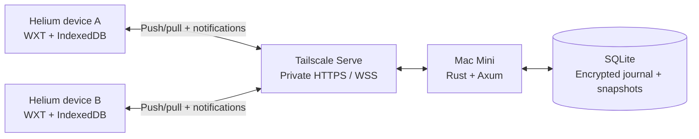

# Helium Sync — Implementation Plan

**Status:** Implementation active through sections 1–9; bookmark/session/history capture and transport implemented; native Helium acceptance, history erasure/scale and security/server hardening pending.

**Updated:** 2026-10-01  
**Stack:** WXT + TypeScript extension; Rust + Axum + SQLite server; Mac Mini hosting; Tailscale networking.  
**Phase-one scope:** Bookmarks, history, current sessions, closed/previous sessions, encryption, offline operation, and self-hosting.  
**Future research:** Optional iCloud backup or alternate sync transport. No iCloud implementation in phase one.

## How to track progress

- Change an implementation task from `- [ ]` to `- [x]` only after its acceptance criteria pass.
- Mark a milestone complete only when its exit gate passes; scaffolding alone does not count.
- Record significant decisions and deviations in the decision log at the end.
- Record evidence beside completed gates: test results, relevant commits, or manual verification notes.
- If an item is blocked, add a short `Blocked: ...` note below it and continue independent work.

| Milestone                                        | Status                 | Depends on | Exit evidence                                                       |
| ------------------------------------------------ | ---------------------- | ---------- | ------------------------------------------------------------------- |
| M1 — Compatibility and hosting probes            | In progress            | None       | WXT builds; native lifecycle/API and Tailscale probes pending       |
| M2 — Durable local state and encrypted transport | Foundation implemented | M1         | 135 TS + 10 relay + 5 cross-stack tests; native gates pending       |
| M3 — Bidirectional bookmarks                     | In progress            | M2         | Model/adapter tests; live Helium gate pending                       |
| M4 — Current, closed, and previous sessions      | In progress            | M2         | Snapshot/capture/restore tests; live Helium gate pending            |
| M5 — Cross-device history and deletion           | In progress            | M2         | Model/transport/adapter/UI evidence; purge/scale/live gates pending |
| M6 — Production hosting and recovery             | Planned                | M3–M5      | —                                                                   |
| M7 — Product polish and release                  | Planned                | M6         | —                                                                   |

## Initial implementation checkpoint — 2026-10-01

These checks apply to synthetic diagnostic notes only. They do not complete browser adapters or milestone exit gates. See [progress.md](progress.md) for evidence and current limitations.

- [x] Move the repository to `/Users/mihirpandey/Work/fun/helium-synk`, outside Documents/iCloud.
- [x] Initialize WXT/React, TypeScript core, and Rust/SQLite workspaces with lockfiles.
- [x] Configure Conventional Commit validation and private-package Changesets.
- [x] Persist local diagnostic records and the encrypted outgoing queue atomically.
- [x] Reserve unique author counters durably and preserve immutable ciphertext across retries.
- [x] Use client-side HKDF and AES-256-GCM with fresh nonces/authenticated metadata.
- [x] Issue distinct profile API credentials; store only their hashes on the relay.
- [x] Commit encrypted relay records with WAL/FULL durability before acknowledging/broadcasting.
- [x] Validate idempotent retries, conflicting identities, byte-bounded batches, and ordered cursor pages.
- [x] Verify SQLite storage exhaustion rejects without acknowledging, preserves client queues, and permits an identical retry after recovery.
- [x] Commit decrypted incoming records and cursor progress together; retain the cursor on failure.
- [x] Pause safely on a changed server epoch while retaining local work.
- [x] Add authenticated WebSocket hints and an alarm/reconnect reconciliation path.
- [x] Build an enrollment/status/recovery-key/test-note options dashboard.
- [x] Verify short synthetic outages, client database reopening, and relay restart across the real HTTP boundary.
- [ ] Verify the production extension in two disposable Helium profiles with DevTools closed.
- [ ] Verify worker termination/revival and an hours-long browser outage.
- [ ] Configure and verify private HTTPS/WSS through Tailscale Serve on the Mac Mini.
- [ ] Complete the remaining M1/M2 exit gates before daily use of bookmark sync.

## Native bookmark implementation checkpoint — 2026-10-01

- [x] Persist native-event clocks/inbox, mappings, import backups and browser-effect intents in IndexedDB v3.
- [x] Verify 22 browser-port tests, including two-tree offline convergence, genuine edits during application, delayed capture, ambiguous creates and storage failures.
- [x] Build opt-in preview/backup/recovery controls; exercise actual components with synthetic UI responses and a 390 px layout.
- [ ] Verify capture/application, root capabilities, worker revival and outage behavior in real disposable Helium profiles.

The checked implementation items use compiled code and simulated browser-port evidence. No native API, hours-long outage or milestone exit gate is claimed complete. Automated checks currently pass 135 TypeScript, 10 Rust and 5 real-relay integration tests.

## Session implementation checkpoint — 2026-10-01

- [x] Persist source-owned current/closed/previous snapshots and validate durable encrypted multipart delivery.
- [x] Persist native window caches and preserve closed windows independently of relay availability.
- [x] Handle worker/browser incarnation changes, paused collection, private-window exclusion and storage failures through tested browser ports.
- [x] Journal bounded tab/window restoration with marker recovery, pins/order/groups/active selection and visible partial progress.
- [x] Build source-profile/type filters, capture-age display, explicit saving and open-tab/window/all controls; exercise synthetic desktop and 390 px UI.
- [x] Verify session convergence and encrypted SQLite storage across real relay/client restarts.
- [ ] Verify live Helium capture/restoration, DevTools-closed lifecycle and hours-long outages together in disposable profiles.

The [session contract](sessions.md) records supported behavior and recovery limits. Implementation evidence is separate from the live acceptance items in section 6 and M4; no whole milestone exit gate is complete.

## History implementation checkpoint — 2026-10-01

- [x] Define individual visit identities, original timestamps, local queries and permanent selected-record deletion markers.
- [x] Verify concurrent global/source/URL generation barriers, delayed uploads and prevention of retagged re-import across delivery permutations.
- [x] Verify eight history pipeline/index/migration tests and 21 native capture/audit tests, including pause boundaries and captured-batch preservation.
- [x] Verify original visit timestamps and stale-upload suppression across real relay/client restart; exercise synthetic history UI at desktop and 390 px.
- [x] Implement native capture/reconciliation baselines, history storage/transport and the indexed dashboard; verify through simulated ports and the real relay.
- [ ] Verify full-scale journal behavior and real Helium history/event/lifecycle/clock behavior.
- [ ] Coordinate logical removal with local content removal, ciphertext purge and backup-retention behavior.

These checks use simulated native ports, synthetic UI responses and the real relay. History collection is opt-in in the development build. The [history contract](history.md) records the remaining erasure/scale/live acceptance work; section 7/M5 exit gates remain open.

## 1. Product requirements and boundaries

### Required behavior

- [ ] Synchronize bookmark creation, title/URL edits, folder structure, moves, ordering, and deletion in both directions.
- [ ] Collect history visits with their original timestamps and source-device identity.
- [ ] Search and filter history across devices in the extension UI.
- [ ] Publish each device's current windows, tabs, pinned state, active tab, and tab groups.
- [ ] Keep closed windows and previous snapshots recoverable, grouped by source device.
- [ ] Open one remote tab, one remote window, or all windows from a remote session as real Helium windows/tabs.
- [ ] Continue local use and capture changes while the Mac Mini or Tailscale connection is unavailable.
- [ ] Automatically reconcile changes when connectivity returns.
- [ ] Show connection state, pending uploads, last successful sync, and remote snapshot age.

### Scope rules

- Passwords, cookies, extension installations, browser preferences, and Chromium profile databases are outside phase one.
- Remote restoration uses the destination device's existing login state.
- Sessions remain owned by their source installation. Closing a tab on one device never automatically closes a tab elsewhere.
- Browser execution state—forms, JavaScript memory, scroll position, and back/forward stacks—is outside the restoration guarantee.
- Incognito collection is disabled by default.
- iCloud is a future research item, not a phase-one dependency or fallback.
- Initially support desktop Helium. Other Chromium browsers require compatibility verification; mobile support is a separate scope decision.

## 2. Offline persistence contract

**A server outage of hours or days must not erase locally persisted data.** Each enrolled browser installation maintains its own durable replica and upload queue. Native bookmarks/history remain in the browser, while sync metadata, replicated records, and session snapshots live in the extension's IndexedDB database.

Local availability covers records already downloaded and records captured on that installation, subject to explicitly configured retention. It does not include changes made elsewhere that have never reached the device.

| Situation                                        | Required behavior                                                                                                  |
| ------------------------------------------------ | ------------------------------------------------------------------------------------------------------------------ |
| Mac Mini offline; clients remain running         | Local use and collection continue; outgoing work queues durably; remote data remains at its last received revision |
| Tailscale disconnected                           | Same offline behavior; connection status identifies the interruption                                               |
| Browser closed or device asleep                  | Stored data and pending work survive; collection stops until the browser runs again                                |
| Extension worker stops unexpectedly              | Restart from persisted state; resume unfinished work; reconcile with actual browser state                          |
| Server returns                                   | Pull missed records, merge with pending local work, upload idempotently, and reconcile browser state               |
| New device enrolled during an outage             | Cannot finish server registration/bootstrap until service returns                                                  |
| Local storage fills or fails                     | Surface a durable-storage error; never report queued/synced success for an uncommitted write                       |
| Profile deleted, extension removed, or disk lost | Local-only changes may be lost; recovery requires another surviving replica/export/backup                          |

### Durability tasks

- [ ] Use IndexedDB transactions for logical state plus corresponding outbox records.
- [ ] Persist received records, logical merge results, and cursor progress consistently.
- [ ] Keep a persistent browser-application journal for work that crosses the IndexedDB/browser API boundary.
- [ ] Request `unlimitedStorage` for the replicated dataset and verify Helium's behavior; monitor actual disk usage and write failures.
- [ ] Keep essential state out of worker globals, popup state, and session-only storage.
- [ ] Preserve the extension identity across development/release upgrades so the storage origin does not unexpectedly change.
- [ ] Never age out unacknowledged bookmark/history/deletion operations just because their normal retention period elapsed.
- [ ] Allow unsent current-session snapshots to coalesce into a newer snapshot, while preserving closed/history snapshots according to policy.
- [ ] Make queue limits explicit; warn or pause affected collection before silently discarding required work.
- [ ] Provide an export that includes logical state, tombstones, and pending operations for recovery.
- [ ] Reconcile missed events on startup and after interruption; document that abrupt termination before capture can lose transient session details.

Chrome documents IndexedDB access from workers and extension-storage persistence. `unlimitedStorage` exempts extension storage from quota restrictions and eviction, but does not create physical disk space or protect against profile deletion. [Storage and cookies](https://developer.chrome.com/docs/extensions/develop/concepts/storage-and-cookies)

### Example outage acceptance test

- [ ] Start with two synchronized installations, A and B.
- [ ] Stop the server for at least several hours while continuing to use both browsers.
- [ ] Rename a bookmark on A and move the same bookmark on B; add independent bookmarks and history visits on both.
- [ ] Close a window on A and verify its cached closed-session record remains available locally.
- [ ] Restart both browsers while the server is still unavailable.
- [ ] Verify persisted remote caches and pending changes survive the restart.
- [ ] Restart the server and verify both bookmark edits survive, records deduplicate, sessions refresh, and queues drain.
- [ ] Repeat with one client reconnecting later than the other.

**Replication is not backup.** A synchronized deletion can reach every device. Server backups, recovery exports, and encryption-key recovery remain separate requirements.

## 3. Architecture and responsibilities



| Component               | Responsibility                                                                                             |
| ----------------------- | ---------------------------------------------------------------------------------------------------------- |
| WXT background worker   | Register browser listeners; coordinate durable capture, transport, reconciliation, and browser application |
| TypeScript sync core    | Deterministic merges, causal metadata, validation, protocol handling; independent of UI/browser APIs       |
| Browser adapters        | Convert bookmark/history/session APIs into domain records and apply resulting state                        |
| IndexedDB through Dexie | Logical replicas, ID mappings, outbox/inbox, journals, local search index, cursors, and checkpoints        |
| WXT storage             | Small settings such as endpoint and preferences; not the main sync database                                |
| React extension pages   | Setup, devices, sync status, sessions, history, import preview, and recovery                               |
| Rust/Tokio/Axum         | Authentication, bounded API requests, encrypted relay, delivery journal, notifications, health checks      |
| SQLx/SQLite             | Transactions, uniqueness constraints, indexed retrieval, migrations, durable storage                       |
| WebCrypto               | Client-side encryption and key derivation                                                                  |
| launchd                 | Native service startup/restart and managed process lifecycle                                               |
| Tailscale Serve         | Tailnet-only HTTPS/WSS access to the localhost service                                                     |

Suggested repository layout:

```text
extension/          WXT entrypoints, UI, adapters, local database
sync-core/          Pure TypeScript domain/protocol/merge logic
server/             Rust crate, database migrations, API, CLI
protocol/           Versioned schemas, examples, test vectors
tests/              Cross-installation and failure/recovery scenarios
deploy/macos/       launchd template and deployment documentation
docs/               Decisions, recovery procedures, contributor guide
```

- [ ] Keep transport/storage interfaces small and independent of domain merging.
- [ ] Ship only the Rust-server transport in phase one; do not implement a plugin framework for speculative backends.
- [ ] Maintain shared protocol fixtures and compatibility tests across TypeScript and Rust.
- [ ] Distinguish physical device names from installation IDs: two browser profiles on one Mac are separate sync authors.

## 4. Sync protocol and near-realtime behavior

### Data flow

1. Capture a browser event and persist logical state plus an outbox operation.
2. Encrypt the immutable operation and send a bounded HTTP batch.
3. Server authenticates, validates the envelope, deduplicates, and commits to SQLite.
4. Return acknowledgements only after commit; notify peers afterward.
5. Peers pull changes after their durable cursor, verify/decrypt, merge, and persist.
6. Apply browser mutations through a recoverable journal and verify results.

| API                             | Purpose                                                                   |
| ------------------------------- | ------------------------------------------------------------------------- |
| `POST /v1/pairing/...`          | Single-use installation registration                                      |
| `POST /v1/sync/push`            | Idempotent upload of encrypted operations/records                         |
| `GET /v1/sync/pull?cursor=...`  | Bounded ordered pages after a saved cursor                                |
| `POST /v1/sync/ack`             | Durable processing progress used for later checkpoint/retention decisions |
| `GET /v1/events`                | Authenticated WebSocket notifications                                     |
| `/v1/devices/...`               | List/revoke installations and rotate credentials                          |
| `/health/live`, `/health/ready` | Process and database readiness                                            |

### Protocol checklist

- [ ] Give every operation a unique ID, author installation ID/counter, schema version, and encrypted payload.
- [ ] Use a non-reused monotonically increasing server sequence for retrieval within a server epoch.
- [ ] Keep merge revisions separate from server delivery sequences and wall-clock timestamps.
- [ ] Reject reuse of an operation ID with a different envelope; retrying the same operation returns its original result.
- [ ] Use at-least-once delivery and idempotent effects; do not claim exactly-once network delivery.
- [ ] Preserve unacknowledged work across timeouts and ambiguous upload responses.
- [ ] Authenticate WebSockets without putting long-lived credentials in URLs; use a short-lived ticket or authenticated initial message.
- [ ] Treat notifications as hints; pull immediately after reconnect even if no notification arrived.
- [ ] Prevent the initial pull/subscription race with a catch-up pull after subscription is established.
- [ ] Use one coordinator per installation, bounded batches, timeouts, exponential backoff, and jitter.
- [ ] Handle invalid authentication separately from temporary network failure.
- [ ] Quarantine invalid/incompatible records and surface the error; do not silently advance over required unprocessed changes.
- [ ] Store processing/application progress so a crash can safely resume.
- [ ] Define supported protocol/schema versions and explicit upgrade-required responses.

### Starting latency targets

These are targets to measure, not guarantees while a browser/device/network is unavailable.

| Work                         | Healthy-connection target                                         |
| ---------------------------- | ----------------------------------------------------------------- |
| Bookmark propagation         | Usually 1–3 seconds                                               |
| Current-session publication  | 2–5 seconds after changes settle                                  |
| History publication          | 5–15 seconds                                                      |
| Missed-notification recovery | Next reconnect or approximately 30–60-second reconciliation alarm |

- [ ] Debounce bookmarks briefly and sessions around two seconds, with a maximum publication delay.
- [ ] Exchange WebSocket application messages approximately every 20 seconds in responsive mode.
- [ ] Persist all essential state despite the heartbeat; workers can still terminate unexpectedly.
- [ ] Recreate missing alarms and reconcile on startup, UI-open/manual-sync, and connection recovery.
- [ ] Validate minimum Chromium behavior in Helium before choosing the manifest baseline.
- [ ] Measure latency with DevTools closed and under representative offline/reconnect conditions.

Chromium 116+ lets WebSocket traffic reset a worker's idle timer; Chromium 120+ supports 30-second alarm periods. The design must still tolerate termination and delayed alarms. [WebSockets](https://developer.chrome.com/docs/extensions/how-to/web-platform/websockets), [worker lifecycle](https://developer.chrome.com/docs/extensions/develop/concepts/service-workers/lifecycle)

## 5. Bookmark synchronization

### Identity and merge policy

- [x] Assign each logical bookmark/folder a sync UUID; map it to installation-local Chromium IDs.
- [x] Merge title and URL as independent fields.
- [x] Treat parent and position as an atomic placement value.
- [x] Track logical revisions plus causal context to distinguish sequential edits from concurrent edits.
- [x] Use deterministic logical-counter/installation-ID ordering for same-field concurrent edits.
- [x] Retain alternate concurrent values in a conflict/recovery journal.
- [x] Use sortable position tokens with deterministic collision tie-breaking; translate into browser indexes.
- [x] Make ordering rebalance deterministic and test it against concurrent offline inserts/moves.
- [x] Retain deletion tombstones throughout V1; never garbage-collect them merely by age.
- [x] Make explicit restoration create a new entity linked to the deleted entity.

| Conflict                                | Required result                                                                 |
| --------------------------------------- | ------------------------------------------------------------------------------- |
| Rename on A, move on B                  | Both changes survive                                                            |
| Concurrent renames                      | Deterministic winner; alternate remains recoverable                             |
| Delete vs edit                          | Entity remains deleted; edited state can be recovered                           |
| Concurrent folder moves create a cycle  | Deterministic valid-tree projection; preserve recoverable placement information |
| Offline child created in deleted folder | Preserve it in a shared deterministic Recovered bookmarks folder                |
| Concurrent inserts at same position     | Stable, identical order on all clients                                          |

- [x] Specify folder deletion against the descendants it actually observed, so unseen concurrent children are not silently erased.
- [x] Specify deterministic handling of missing/deleted parents and invalid placement.
- [x] Prove convergence from the same operation set regardless of arrival order.

**Bookmark evidence (2026-10-01):** Causal merge, encrypted journal and native adapter are implemented; the native checkpoint records 22 adapter tests and synthetic UI evidence. The complete suite currently passes 135 TypeScript tests, 10 relay tests and 5 real-process integration tests. Real Helium acceptance remains pending. See the repository `docs/bookmark-merge.md` and `docs/progress.md`.

### Browser integration and onboarding

- [ ] Capture creation, title/URL changes, moves, removal, and children-reordered events.
- [ ] Map browser root folders by capabilities/role; handle unmodifiable nodes explicitly.
- [x] Persist an intended mutation before calling browser APIs, then persist its observed result.
- [x] Match expected resulting events to prevent echo uploads without ignoring genuine user edits.
- [x] Reconcile actual browser state before retrying interrupted create/move/delete work.
- [ ] Perform startup and periodic full-tree reconciliation.
- [x] Bootstrap the first installation from its existing bookmarks.
- [x] Preview the merge on later installations; preserve unmatched entries and intentional duplicates.
- [x] Match identical entries conservatively using folder context, URL, and title.
- [x] Export a recovery copy before the first substantial merge.
- [x] Treat lost local sync metadata as a re-enrollment/recovery situation rather than inferring mass deletion.

Reference: [Chrome bookmarks API](https://developer.chrome.com/docs/extensions/reference/api/bookmarks).

## 6. Current, closed, and previous sessions

- [ ] Capture installation/device name, capture time, source revision, ordered windows/tabs, URLs/titles, pinned state, active tab, and group metadata.
- [ ] Allocate internal snapshot/window/tab/group identities; do not use runtime browser IDs as cross-device identities.
- [ ] Restrict publication to the source installation and reject stale source revisions.
- [ ] Publish debounced current-session snapshots and retain selected previous snapshots.
- [ ] Cache window contents before closure; capture closed records from the cache and supplement with local recently-closed APIs.
- [ ] Retain the last good snapshot after abrupt shutdown; do not depend on a final shutdown callback.
- [ ] Show snapshot age separately from device connectivity/heartbeat.
- [ ] Provide open-tab, open-window, and open-all actions.
- [ ] Restore real windows/tabs, then pinning, ordering, groups, group metadata, and active tabs.
- [ ] Journal restoration progress to avoid blindly duplicating windows/tabs after interruption.
- [ ] Validate schemes; default automatic restoration to HTTP/HTTPS and explain skipped local/internal/unsupported URLs.
- [ ] Bound restoration concurrency and show progress/partial failures for large sessions.
- [ ] Use destination-appropriate window placement instead of forcing coordinates from another monitor arrangement.
- [ ] Keep source sessions intact when they are restored elsewhere.
- [ ] Preserve useful closed-session records during an outage instead of replacing them with only the latest current state.

Public APIs support window/tab/group restoration, but do not let the extension insert its own foreign devices into Chromium's built-in session machinery. The extension provides that device grouping. Local recently-closed retrieval is limited to 25 entries, so it cannot be the only archive. [Windows](https://developer.chrome.com/docs/extensions/reference/api/windows), [tabs](https://developer.chrome.com/docs/extensions/reference/api/tabs), [tab groups](https://developer.chrome.com/docs/extensions/reference/api/tabGroups), [sessions](https://developer.chrome.com/docs/extensions/reference/api/sessions)

## 7. Cross-device history and deletion

- [ ] Store individual visit records with original timestamp, source installation, URL/title, and available transition/referrer metadata.
- [ ] Namespace native visit IDs by installation/profile incarnation; deduplicate the same visit while preserving separate visits.
- [ ] Combine events with overlapping reconciliation scans and paginated, bounded initial import.
- [ ] Keep decrypted search/index state local; the server cannot search encrypted URLs or titles.
- [ ] Show unified timeline and per-device filters.
- [ ] Keep native browser history local; do not inject remote visits at fabricated current timestamps.
- [ ] Exclude incognito capture and support domain exclusions/pause controls.
- [ ] Process native URL/all-history removal events for that installation's corresponding synchronized records.
- [ ] Provide explicit extension deletion scopes: selected records, one installation, or all installations.
- [ ] Define per-source clear barriers/generations and deletion markers that prevent re-import/resurrection, including delayed offline uploads.
- [ ] Keep deletion metadata long enough to cover all active clients; stale clients require rebootstrap before contributing old state.
- [ ] Coordinate logical erasure with ciphertext purge/retention; distinguish live deletion from expiration of historical backups.
- [ ] Document any event/reconciliation capture limits; do not promise complete archival of visits never captured locally.

`history.addUrl()` adds a visit at the current time rather than an arbitrary original timestamp. The extension's database is the canonical cross-device timeline. [Chrome history API](https://developer.chrome.com/docs/extensions/reference/api/history)

## 8. Encryption, registration, and permissions

- [ ] Generate a random master key on the first trusted client; never send it unprotected to the server.
- [ ] Derive separate domain/author-installation keys using HKDF.
- [ ] Encrypt with AES-256-GCM, fresh 96-bit nonces, and authenticated envelope metadata.
- [ ] Persist immutable ciphertext for retries; prevent operation-ID reuse with changed contents.
- [ ] Version encryption envelopes and key epochs; define nonce safety across installation resets and restores.
- [ ] Define whether each installation auto-unlocks or requires an unlock secret; document local cached-data/key protection.
- [ ] Use distinct high-entropy API credentials per installation and store only credential hashes on the server.
- [ ] Provide a high-entropy out-of-band pairing bundle with a short-lived, single-use server registration invitation.
- [ ] Keep master-key material local to clients during registration and out of logs/ordinary URL parameters.
- [ ] Export a separate recovery bundle and document that server backups alone cannot decrypt data.
- [ ] Revoke API access immediately and define future-data key rotation for removal of a compromised installation.
- [ ] Explain that revocation cannot erase already-downloaded data or invalidate knowledge of old keys.
- [ ] Request only required browser APIs and the configured server host; avoid broad browsing-site host access/content scripts.
- [ ] Render titles/URLs as untrusted text and keep the extension CSP restrictive.
- [ ] Avoid logging browsing contents, tokens, keys, pairing bundles, or sensitive query parameters.

E2EE protects contents stored on the relay and in its backups. The relay still sees delivery metadata such as account/installation IDs, timing, sizes, and sequence. Local decrypted caches and native browser data have their own device-security requirements.

References: [AES-GCM parameters](https://developer.mozilla.org/en-US/docs/Web/API/AesGcmParams), [extension permissions](https://developer.chrome.com/docs/extensions/develop/concepts/declare-permissions).

## 9. Rust server and SQLite

| Table               | Responsibility                                                                 |
| ------------------- | ------------------------------------------------------------------------------ |
| `accounts`          | Account identity, protocol settings, and server/restore epoch                  |
| `devices`           | Installation identity, credential hash, revocation, activity, durable progress |
| `change_log`        | Non-reused server sequence, unique operation ID, author, encrypted envelope    |
| `snapshots`         | Encrypted sessions and later client-generated checkpoints                      |
| `pairing_invites`   | Hashed invitations, expiry, single-use state                                   |
| `schema_migrations` | Database migration history                                                     |

- [ ] Use WAL mode on a local disk, `synchronous=FULL`, foreign keys, and configured busy timeout.
- [ ] Keep transactions short; control write concurrency and use a small connection pool.
- [ ] Add operation uniqueness constraints, cursor indexes, and bounded pagination.
- [ ] Validate envelope/schema versions, batch size, payload size, and author authorization.
- [ ] Limit account storage and WebSocket message/buffer sizes; handle slow clients by disconnecting safely.
- [ ] Acknowledge only committed records; broadcast only after commit.
- [ ] Handle disk-full/database errors explicitly without discarding the client's pending work.
- [ ] Add graceful shutdown and migration compatibility checks.
- [ ] Keep the V1 bookmark journal uncompacted; monitor growth.
- [ ] Before future compaction, define client-generated encrypted checkpoints, acknowledged frontiers, device retirement, and forced rebootstrap rules.

SQLite WAL supports concurrent readers and a writer but only one active writer. Use filesystem storage outside iCloud Drive/network-sync folders. [SQLite WAL](https://www.sqlite.org/wal.html), [SQLx SQLite configuration](https://docs.rs/sqlx/latest/sqlx/sqlite/struct.SqliteConnectOptions.html)

## 10. Mac Mini deployment, availability, and backups

- [ ] Build a native Rust release binary and bind it only to `127.0.0.1`.
- [ ] Run it through launchd with limited filesystem permissions, automatic restart, and explicit data/log paths.
- [ ] Keep persistent data outside the source checkout and synchronized cloud folders.
- [ ] Configure Tailscale Serve for private HTTPS/WSS access with a stable tailnet hostname.
- [ ] Restrict tailnet access to intended clients and retain application authentication.
- [ ] Keep public Funnel exposure out of this deployment.
- [ ] Verify certificate/endpoint behavior and Tailscale restart/reconnection.
- [ ] Prevent system sleep while permitting display sleep; configure supported power-failure startup behavior.
- [ ] Test logout/reboot/cold-start behavior with the installed Tailscale variant and FileVault configuration.
- [ ] Preserve FileVault; document any required unlock/login recovery step before claiming unattended availability.
- [ ] Monitor process/database readiness, disk usage, last successful backup, journal growth, and aggregate queue/latency metrics.
- [ ] Rotate logs and bound their storage.
- [ ] Back up before upgrades/migrations and document binary/database rollback compatibility.
- [ ] Generate consistent daily backups using SQLite backup facilities or a coordinated snapshot procedure.
- [ ] Keep at least one encrypted backup off the Mac Mini; back up encryption recovery material separately.
- [ ] Test restoration into an isolated instance before calling backup recovery complete.
- [ ] Announce a new restore epoch after restoring an older database; clients halt destructive application, preserve pending work, and reconcile surviving replicas.
- [ ] Define a recovery procedure for server disk loss, including missing acknowledged operations and surviving client exports.

Do not copy only the live database file and assume it contains WAL changes. [SQLite backup API](https://www.sqlite.org/backup.html)

Tailscale Serve supplies tailnet-only HTTPS access to local services. Reboot/login availability must be measured: current Tailscale guidance differs between its unattended-mode and advanced macOS-variant pages. [Serve](https://tailscale.com/docs/features/tailscale-serve), [unattended guidance](https://tailscale.com/docs/how-to/run-unattended), [macOS variants](https://tailscale.com/docs/concepts/macos-variants)

Apple documents desktop sleep/power-recovery settings and FileVault startup requirements. [Energy settings](https://support.apple.com/en-gb/guide/mac-help/mchlp1168/mac), [FileVault](https://support.apple.com/guide/deployment/intro-to-filevault-dep82064ec40/1/web/1.0)

### Proposed retention defaults

| Data                         | Initial policy                                                              |
| ---------------------------- | --------------------------------------------------------------------------- |
| Current session              | Latest per installation                                                     |
| Previous/closed sessions     | 30 days plus count/size caps                                                |
| History                      | 90 days, configurable                                                       |
| Bookmark tombstones          | Retained throughout V1                                                      |
| Pending essential operations | Retained until acknowledged or explicitly resolved/exported                 |
| Backups                      | Daily, with weekly/monthly rotation; exact counts decided before deployment |

- [ ] Define retention against record semantics; encrypted historical visit timestamps are not visible to the server.
- [ ] Specify client-driven expiry or deliberately disclosed expiry metadata rather than assuming server receipt time equals visit time.
- [ ] Document which data is replicated locally, retention settings, and backup-deletion lag.

## 11. Milestone exit gates

### M1 — Compatibility and hosting probes

- [ ] Create a disposable two-profile Helium environment and verify required APIs/permissions.
- [ ] Verify WXT background startup, worker termination/revival, alarms, and persistent storage.
- [ ] Demonstrate representative window/tab/group capture and restoration.
- [ ] Demonstrate authenticated HTTPS/WSS through Tailscale Serve.
- [ ] Record Chromium version constraints and Mac Mini reboot/login limitations.
- [ ] **Exit gate:** Compatibility evidence is recorded; no test modifies the user's real bookmark collection.

### M2 — Durable local state and encrypted transport

- [ ] Implement protocol fixtures, IndexedDB schema/migrations, pairing, encryption, outbox/inbox, and server journal.
- [ ] Implement push/pull, notifications, retries, cursor handling, and visible offline status.
- [ ] Exercise dropped acknowledgements, duplicate requests, server restart, and worker termination.
- [ ] Exercise the hours-long outage test with synthetic domain records.
- [ ] **Exit gate:** Captured committed records survive restarts and outages, deduplicate, and converge after reconnect.

### M3 — Bidirectional bookmarks

- [ ] Implement the merge policies, deterministic valid-tree projection, mappings, event capture, and browser application journal.
- [ ] Implement first/second-device import, preview, recovery export, and reconciliation.
- [ ] Exercise every bookmark conflict listed in section 5.
- [ ] **Exit gate:** Two profiles converge after concurrent/offline edits without losing independent changes or intentional duplicates.

### M4 — Sessions

- [ ] Implement device-owned current snapshots, previous snapshots, closed-window archive, and session UI.
- [ ] Implement recoverable real-browser restoration and partial-failure reporting.
- [ ] Exercise closure during outage, abrupt shutdown, stale revisions, and interrupted large restores.
- [ ] **Exit gate:** Multi-window restoration preserves supported ordering/pins/groups and avoids unintended cross-device closing.

### M5 — History

- [ ] Implement individual visits, bounded import/reconciliation, local search, device filters, and deletion/clear barriers.
- [ ] Exercise duplicate visits, original timestamps, native clearing, and delayed uploads after deletion.
- [ ] **Exit gate:** Search shows correct source/timestamps and erased visits do not reappear after reconnect/reconciliation.

### M6 — Production hosting and recovery

- [ ] Implement launchd deployment, permissions, Tailscale access rules, monitoring, backups, and upgrade/recovery documentation.
- [ ] Run outage, disk-full, reboot, service restart, older-backup restoration, and server-disk-loss exercises.
- [ ] **Exit gate:** Operational evidence identifies recovery steps and proves backup restoration with surviving client state.

### M7 — Product polish and release

- [ ] Complete setup/import guidance, clear status/error messages, conflict recovery, exclusions, and retention controls.
- [ ] Keep the popup compact; provide the full Sessions/History dashboard as an extension page.
- [ ] Evaluate a packaged `chrome://history` override after the dashboard is stable; explain the choice before enabling it.
- [ ] Complete protocol compatibility, dependency checks, and stable extension distribution/identity procedure.
- [ ] Run daily-use verification across the user's actual intended devices after disposable-profile gates pass.
- [ ] **Exit gate:** Daily use, offline recovery, and documented self-hosting are reliable; unresolved limitations are recorded.

Chrome supports a packaged History-page override. Treat whether to ship that build variant as a release decision. [Page overrides](https://developer.chrome.com/docs/extensions/develop/ui/override-chrome-pages)

## 12. Verification matrix

- [ ] Different arrival orders produce identical logical bookmark state.
- [ ] Repeated upload/apply attempts do not create duplicate operations or bookmarks.
- [ ] Browser mutation followed by worker termination recovers its mapping/effect correctly.
- [ ] Genuine local edits during remote application remain captured.
- [ ] Missed notifications and reconnect races recover through pull.
- [ ] Clock skew does not decide merge winners.
- [ ] Concurrent folder cycles/deletion/ordering resolve consistently.
- [ ] An old offline client cannot resurrect deleted bookmarks or erased history.
- [ ] Browser updates preserve extension storage and identity.
- [ ] Full local/server disk errors remain visible and preserve retryable work.
- [ ] Corrupted/incompatible ciphertext does not silently disappear behind an advanced cursor.
- [ ] Revoked credentials fail; key rotation excludes the revoked installation from future data.
- [ ] Large datasets and large restores remain bounded and responsive.
- [ ] Backups restore consistently; epoch changes trigger safe client reconciliation.
- [ ] Lifecycle tests run with DevTools closed.

## 13. Future scope: optional iCloud

**Research only. No iCloud auth, SDK, credentials, transport, native helper, or automatic failover in phase one.**

Apple CloudKit exposes app containers/databases through web APIs. This makes it a candidate to investigate, but does not establish that its authentication, API access, or hosted SDK model fits a packaged MV3 extension. Apple-account/container setup and extension-policy compatibility need a separate feasibility spike. [CloudKit JS](https://developer.apple.com/documentation/CloudKitJS), [CloudKit Web Services](https://developer.apple.com/library/archive/documentation/DataManagement/Conceptual/CloudKitWebServicesReference/SettingUpWebServices.html)

| Future option                | What it provides                                         | What it does not automatically provide                                              |
| ---------------------------- | -------------------------------------------------------- | ----------------------------------------------------------------------------------- |
| Encrypted iCloud backup      | Off-host recovery copies                                 | Live device-to-device sync while the Mini is offline                                |
| Alternate CloudKit transport | Potential cloud relay independent of the Mini            | Compatibility with our journal, deletion, and checkpoint model without extra design |
| Dual-transport fallback      | Potential continued synchronization during a Mini outage | Safe automatic failover without deduplication, ordering, and reconciliation rules   |

- [ ] Verify Apple developer/container requirements, private database access, authentication/session renewal, quotas, and platform support.
- [ ] Evaluate direct documented HTTP APIs versus a separate native companion; avoid making the Mini the required iCloud gateway for outage fallback.
- [ ] Verify MV3 CSP and packaged-code compatibility; do not assume Apple's remotely hosted JavaScript SDK can run directly in the extension.
- [ ] Preserve application-level E2EE if Apple becomes a storage provider.
- [ ] Preserve operation identities/causal metadata across transports; keep cursors/checkpoints specific to each transport.
- [ ] Specify how clients detect, deduplicate, and reconcile operations received through both transports.
- [ ] Specify deletion, device revocation, retention, checkpoint authority, and key rotation across both backends.
- [ ] Test reconnecting the Mini after different clients used different transports during an outage.
- [ ] Prefer explicit backend selection initially; add automatic failover only after convergence and recovery are proven.
- [ ] Evaluate privacy/metadata exposure, recovery-key storage, and what happens when Apple authentication expires.

Do not place the live SQLite database or browser profile in iCloud Drive. If a future backup feature uses iCloud Drive, upload completed consistent backup artifacts. A file-sync folder is not a substitute for the operation relay.

Phase one only needs a clean separation between domain logic and transport; it does not need speculative multi-backend infrastructure.

## 14. Decision log and open choices

| Decision                  | Current position                                                              | Revisit when                                |
| ------------------------- | ----------------------------------------------------------------------------- | ------------------------------------------- |
| Extension/server stack    | WXT + TypeScript; Rust/Axum + SQLite                                          | Only if measured requirements invalidate it |
| Hosting/network           | Native Mac Mini service; private Tailscale Serve                              | Deployment verification                     |
| Server outage behavior    | Durable local capture/cache; delayed cross-device propagation                 | M2 outage tests                             |
| Session behavior          | Source-owned snapshots; explicit remote restoration                           | M4 user verification                        |
| Content protection        | Client-side E2EE; separate API authentication                                 | M2 key lifecycle design                     |
| Conflict resolution       | Per-field causal merges and deterministic conflict resolution                 | M3 executable spec                          |
| Local unlock behavior     | Auto-unlock for diagnostic checkpoint; profile stores key and decrypted cache | Before sensitive browser-content adapters   |
| History/session retention | Proposed 90/30 days                                                           | Before M5/M6 deployment                     |
| History-page replacement  | Optional packaged release choice                                              | M7                                          |
| iCloud                    | Future research only                                                          | After phase-one exit gates                  |

### Decisions to settle during implementation planning

- [ ] Select initial devices/browser profiles and supported minimum Helium version.
- [ ] Select local key-unlock policy and recovery-bundle handling.
- [ ] Finalize executable bookmark merge and history-clear specifications.
- [ ] Set storage budgets, supported offline window for future compaction, and backup rotation counts.
- [ ] Verify Tailscale variant, FileVault startup recovery, and exact launchd service arrangement on the Mac Mini.
- [ ] Select stable extension distribution/update method and whether to ship the history override.

### Decision entry template

```markdown
### YYYY-MM-DD — Decision title

- Decision:
- Reason:
- Affected checklist items:
- Verification/evidence:
- Follow-up:
```

### 2026-10-01 — First development checkpoint

- Decision: Start with encrypted synthetic notes before enabling browser-content permissions/adapters. Implement transport durability in parallel with the unfinished M1 native compatibility probes.
- Reason: Exercise restart, offline queue, authentication, encryption, and retry semantics without touching personal browsing data.
- Local protection: Auto-unlock uses profile-local secrets and a decrypted cache; this is not extension-provided local encryption at rest. Separate recovery-key export is available.
- Registration: CLI provisioning of separate per-profile credentials is temporary; single-use pairing remains pending.
- Storage: Source code moved out of Documents to `/Users/mihirpandey/Work/fun/helium-synk`. Production data will live outside the checkout and synchronized folders.
- Evidence: See [progress.md](progress.md); no whole milestone has passed yet.
- Follow-up: Disposable browser lifecycle/permissions probes, Tailscale HTTPS/WSS, bounded storage/pairing/recovery, then executable bookmark convergence specification.
